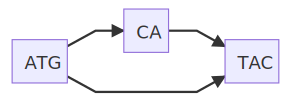

## BIOL8706: Dividing and conquering sequence alignment using De Bruijn Graphs
<!-- paginate: skip -->
<!-- _class: coverpage -->

- Student: Richard Morris
- Huttley lab, Australian National University
- Supervisors: Gavin Huttley, Vijini Mallawaarachchi

# Introduction to sequence alignment
<!-- paginate: true -->
<!-- header: _Dividing and conquering sequence alignment using De Bruijn Graphs_ -->

Given we can sequence genomes of different organisms.  

Sequence A: `ATGCATAC` Sequence B: `ATGTAC`

We can compare sequences.  But first we have to align these sequences to identify common regions

 
 
 

  

    By reviewing features that are common with those that differ

  

  

  If those regions encoded for genes, then we can make some claims about organism genotype, and suggest possible phenotypic differences and similarities.

  

  

$$\begin{array}{c|c|c|c}
& \boxed{ATG} & \boxed{CA} & \boxed{TAC} \\
\hline \text{Sequence A} & \checkmark & \checkmark & \checkmark \\
\hline \text{Sequence B} & \checkmark & \oslash & \checkmark \\
\end{array}$$
  

# Why is multiple sequence alignment (MSA) important?

  

#### Alignment of eg: a viral genome allows us to:
  * Identify conserved regions for vaccine/drug development
  * Identify changes in function to make predictions about the virus' behaviour
  * Identify and prepare for emerging variants

  

  

    
    Alignment of S mutation points of SARS-CoV-2 variants
  

# Why is MSA so computationally expensive?

- An exhaustive solution has an order complexity of $O(L^n)$ 
  - **L** is the length of the sequence 
  - **n** is the number of sequences

# MSA for SARS-CoV-2 genomes?

  

## SARS-CoV-2 
- length: **~29,903** bp
- number: **over 5 million** (as of March 2022) 1
- $O(29,903^\text{over 5 million})$ is a **very large number**
##### **Required: a method to align large numbers of small sequences**

  

  

    <figure>
      
      <figcaption>Fig 1: Artists rendition of SARS-CoV-2</figcaption>
    </figure>
  

<!-- _footer: "1 [doi.org/10.1038/s41588-022-01033-y](doi.org/10.1038/s41588-022-01033-y) | Fig 1 [doi.org/10.7875/togopic.2020.199](doi.org/10.7875/togopic.2020.199)"-->
# MSA for great apes genomes?

  

## The great apes
- length: **~3 billion** bp
- number: 5 
- $O(3 Billion^\text{5})$ is also a very large number.
- However great ape genomes are 97+% identical1
##### **Required: a method to identify the few different regions in very long similar sequences**
  

  

    <figure>
      
      <figcaption>The family tree of great apes</figcaption>
    </figure>
  

<!-- _footer: "1 [citation needed]()"--> 

# Alignment takes energy
 
 
 

  

- Sequence alignment requires **computation**
- Computation requires **energy**

  

  

<figure>
  
</figure>

<!-- _footer: "Created with the Imgflip Meme Generator"-->

# Required: a more efficient method to align 
  - large numbers of small sequences
  - small numbers of very similar long sequences

# Sequence alignment order complexity

## Pairwise sequence alignment
- Compare every letter in one sequence to every letter in the other
- order complexity of $O(mn)$ 
  - where **m** and **n** are lengths of the sequences
## Multiple sequence alignment (MSA)
- Perform a pairwise alignment of every sequence to every other sequence
- order complexity of $O(L^n)$ 
  - where **L** is the length of the sequences 
  - **n** is the number of sequences

<!-- The pairwise algorithms are both actually O(mn) where m and n are the lengths of the 2 sequences. -->

# Pairwise sequence alignment methods: $O(mn)$

  

- Needlemann-Wunsch algorithm: global alignment for highly similar sequences
    - scoring system that penalises gaps and mismatches
- Smith-Waterman algorithm: better for local alignment to find conserved domains
    - allows for alignment to reset when the score falls to 0

  

  

Compare each nucleotide in one sequence to each nucleotide in the other sequence

Given a simple scoring system +1 match, -1 mismatch, -2 gap ($\delta$)

Where $F(i,j) = \max \text{of the following}$

$$
\begin{array}{l} 
⇖ F(i-1, j-1) + s(A_i, B_j), \quad \text{(match/mismatch)}\\
⇑ F(i-1, j) + \delta, \quad \text{(deletion)}\\
⇐F(i, j-1) + \delta, \quad \text{(insertion)}
\end{array}
$$

|  | gap  | A | G | C | A |  A |
|----|---|---|---|---|---|---|
|**gap**|**_0_**|⇐-2|⇐-4|⇐-6|⇐-8|⇐-10
| **A** |⇑-2| ⇖ **_1_** |⇐ **-1** |⇐-3 |⇐-5 |⇐⇖-7|
| **C** |⇑-4|⇑-1 |⇖0 |⇖ **_0_** |⇐-2 |⇐-4|
| **G** |⇑-6|⇑-3 |⇖0 |⇖-1 |⇖ **_1_** |⇐-1|
| **A** |⇑-8|⇖⇑-5 |⇑-2 |⇖-1 | ⇑-1|⇖ **_2_**|
| **A** |⇑-10|⇖⇑-7 |⇑-4 |⇖⇑-3 |⇖-2|⇖⇑ **_0_**|

backtrace from bottom right selecting the value that _**maximizes**_ the alignment score results in the following alignment 

|||||||
|---|---|---|---|---|---|
| sequence 1 | - | C | G | A | A |
| sequence 2 | G | C | G | A | - |

  

# Multiple sequence alignment (MAS) strategies  
- Pairwise alignment of each possible pair
    - ${n\choose 2} \times O(L^2) = \frac{n(n-1)}{2} \times O(L^2) = O(n^2.L^2)$
- Progressive alignment eg: ClustalW
    - create a guide tree  
    - Progressively align pairs most closely related to profiles, and then align profiles 
- Iterative methods  eg: MUSCLE, T-Coffee, MAAFT
    - create an preliminary fast less accurate alignment 
    - iteratively improve alignment using some scoring function
    - Complete when some convergence criterion is met
- Hidden markov models $O(nL) + O(LM)$ (M is the number of states in the model)
    - eg: HMMER
    - create a statical model of the transition between states 
    - Determine likely alignment based on the model

# The problem at the core of genetic alignment

  

 
 

- ## Alignment needs trees
To align sequences accurately and efficiently, one should know the phylogenetic relationships among the sequences to better guide the alignment process
 
 

- ## Trees need alignment
to infer a phylogenetic tree accurately, one needs a well-aligned set of sequences
  

  

 
<!-- _footer: "Created with the Imgflip Meme Generator"-->

# What if we could quickly remove regions that are similar?

### We'd be able to focus our computational resources on just the regions that are different.

# Sequence alignment using De Bruijn Graphs

This work builds on the work by Xingjian Leng in a 12 month undergraduate research project in 2022, under the supervision of Dr. Yu Lin and Prof. Gavin Huttley. 

That project focused on the alignment of closely related viral genomes, with a particular emphasis on SARS-CoV-2. The method is based on the construction and utilization of de Bruijn graphs for both pairwise and multiple sequence alignment tasks.

# De Bruijn graphs

A De Bruijn graph is a directed graph that represents unique overlapping subsequences (or k-mers) at the nodes.  This structure is an efficient way to identify sequence overlaps, and common regions.  

Building a De Bruijn graph has an order complexity of $O(nL)$ 

# Overlapping k-mers

Consider the DNA sequence $\boxed{CACAGTACGGCAT}$ when broken into 3 character overlapping subsequences (or 3-mers) looks like this:

$
\boxed{CAC}\quad\quad\quad\quad\quad\quad \boxed{ACG} \\
\quad \boxed{ACA}\quad\quad\quad\quad\quad\quad \boxed{CGG} \\
\quad\quad \boxed{CAG}\quad\quad\quad\quad\quad\quad \boxed{GGC} \\
\quad\quad\quad \boxed{AGT} \quad\quad\quad\quad\quad\quad \boxed{GCA}\\
\quad\quad\quad\quad \boxed{GTA}\quad\quad\quad\quad\quad\quad \boxed{CAT}\\
\quad\quad\quad\quad\quad \boxed{TAC}\\
$
# De Bruijn graphs

When we represent that as a de Bruijn graph it looks like this:

# A second sequence

Consider we want to align that sequence $\boxed{CACAGTAC\boxed{G}GCAT}$ to the very similar sequence $\boxed{CACAGTAC\boxed{T}CGCAT}$

Which as a De Bruijn graph looks like this:

# De Bruijn pairwise alignment

#### Sequence A: 

#### Sequence B: 

If we combine both sequences into a single de Bruijn graph, we can easily identify the regions that are similar and the regions that are different.

# Resolving the graph

We can collect nodes with 2 edge, or 1 edge into single nodes, and we can see the regions that are similar and the regions that are different.

Now we can use a traditional algorithm to align the regions $\boxed{AC\boxed{G}GC}$ and $\boxed{AC\boxed{T}GC}$, and we've reduced $O(14^2)$ down to $O(5^2)$ = **7.8x** less work.

# De Bruijn multiple sequence alignment

And we can extend this to multiple sequences.  Consider aligning the following sequences
`CACAGTACGGCAT` `CACAGTACTGCAT` `CACAGTACTGGAGCAT`& `CACAGTACTGATGCAT`

  

  

  

  

    Now we've reduced O(13x13x16x16) down to O(6x6x8x8) = <strong>18.8x</strong> less work
  

# Reducing the horizontal complexity of the problem

- Horizontal component of the problem is the length (L) of the sequences to be aligned
- recall an exact alignment has an order complexity of $O(L^n)$
- if we reduce the length of the sequences we need to align we reduce L

#### **How about n?**

# Reducing the vertical complexity of the problem

- Vertical component of the problem is the number of sequences to be aligned (n)

- Any matches or deletions reduces the number of sequences we need to align

# Project aims

* Investigate the use of De Bruijn graphs to identify regions of dissimilarity for traditional alignment algorithms
* Build a python library for investigating De Bruijn Graph Multi-sequence alignment
    * Resolve the De Bruijn graph to a partial order graph to reduce horizontal complexity
    * Convert matched pairs of bubble edges to profiles to reduce vertical complexity
    * Develop unit tests that verify the correctness of the library against edge case sequence alignments
      * long sequences
      * numerous sequences
      * cyclic sequences
      * bubbles within bubbles
      * sequential bubbles
* Develop statistics for any set of sequences, for a range of possible kmer lengths
    * Time complexity 
      * how many alignment operations are required for exact, progressive, 1 dimensional de Bruin graphs, and 2 dimensional de Bruin graphs
    * Memory use ratio
      * how much memory is required to store the partial order graph over the amount present in the sequences
    * Compression ratio
      * how much information about common subsequences is retained in the partial order graph

# Results: projected memory use ratio

Memory complexity is the amount of actual memory required to stor a sequence divided by the amount of memory required for the original sequences

Converted into a partial order graph 

- Memory complexity = $30 / 34$

# Results: projected order complexity

Converted into a partial order graph 

- Exact alignment  = $13\times12\times9 = 1404$
- Progressive alignment = $13\times12+12\times9+13\times9 = 381$
- 1 dimensional de Brujin Graph simplification then progressive alignment = $9\times8+8\times5+9\times5 = 157$
- 2 dimensional de Brujin Graph simplification then progressive alignment =  $4\times5+5\times9+4\times9 =101$

# Results: Projected compression ratio

**Compression ratio** is the average length of the payload of partial order graph (POG) nodes divided by the kmer length used to construct the de Brujin graph the POG was derived from.

A higher compression ratio indicates that the kmer size chosen to construct the de Brujin graph from those sequences captured more information about common subsequences.

Given the POG derived from a de Brujin graph with k=3.

The compression ratio is the mean payload $4.2857$ over the original kmer length of $3$ $=1.4286$

# Results: Calculated order complexity from alignable sequences

  

- BRCA1 genes in 56 species (citation needed)
- BRCA1 genes in primates (citation needed)
- SARS-CoV-2 genomes (citation needed)
- IBD phage components (https://doi.org/10.1016/j.cell.2015.01.002)
- Tara oceans phage components (https://doi.org/10.1126/science.1261605)

  

  

## kmer = 3

| Genomes | Exact | Progressive | 1D dBG | 2D dBG |
|---|---|---|---|---|
| BRCA1 56 species |  |  |  |  |
| BRCA1 primates |  |  |  |  |
| SARS-CoV-2 |  |  |  |  |
| IBD phage |  |  |  |  |
| Tara oceans phage |  |  |  |  |

## kmer = 6

| Genomes | Exact | Progressive | 1D dBG | 2D dBG |
|---|---|---|---|---|
| BRCA1 56 species |  |  |  |  |
| BRCA1 primates |  |  |  |  |
| SARS-CoV-2 |  |  |  |  |
| IBD phage |  |  |  |  |
| Tara oceans phage |  |  |  |  |

## kmer = 9

| Genomes | Exact | Progressive | 1D dBG | 2D dBG |
|---|---|---|---|---|
| BRCA1 56 species |  |  |  |  |
| BRCA1 primates |  |  |  |  |
| SARS-CoV-2 |  |  |  |  |
| IBD phage |  |  |  |  |
| Tara oceans phage |  |  |  |  |
  

# Results: Calculated compression ratio from alignable sequences

- BRCA1 genes in 56 species (citation needed)
- BRCA1 genes in primates (citation needed)
- SARS-CoV-2 genomes (citation needed)
- IBD phage components (https://doi.org/10.1016/j.cell.2015.01.002)
- Tara oceans phage components (https://doi.org/10.1126/science.1261605)

 
 
 

| Genomes | dBG(3) | dBG(4) | dBG(5) | dBG(6) | dBG(7) | dBG(8) | dBG(9) | 
|---|---|---|---|---|---|---|---|
| BRCA1 56 species |  
| BRCA1 primates |  
| SARS-CoV-2 |  
| IBD phage |  
| Tara oceans phage |

# Discussion

# Future directions

Investigate the potential of using de Bruijn Graphs to;

- identify reverse compliment regions from a dBG
- identify genetic distance and infer phylogeny from a dBG

# Thanks

- Gavin Huttley
- Yu Lin
- Vijini Mallawaarachchi
- Xinjian Leng
- Huttley lab

# Questions