## BIOL8706: Dividing and conquering sequence alignment using De Bruijn Graphs
<!-- paginate: skip -->
<!-- _class: coverpage -->


- Student: Richard Morris
- Huttley lab, Australian National University
- Supervisors: Gavin Huttley

# Project aims
<!-- paginate: true -->
<!-- header: <a href="#questions--answers" style="color: inherit; text-decoration: none;">_Dividing and conquering sequence alignment using De Bruijn Graphs_</a>-->

1. construct **de Bruijn graph** from sequences
2. identify **bubbles** in the graph
3. extend **braids** using _Karlin and Altschul_$_1$ statistics
4. compare longest **braids** with ungapped _Smith-Waterman_$_2$
5. contrast performance

<!-- _footer: "<sup>1</sup>[Karlin & Altschul, 1990  doi.org/10.1073/pnas.87.6.2264](https://doi.org/10.1073/pnas.87.6.2264) <br/> <sup>2</sup>[Smith & Waterman, 1981  doi.org/10.1016/0022-2836(81)90087-5](10.1016/0022-2836(81)90087-5)"-->


# BACKGROUND: Sequence alignment


# BACKGROUND: Sequence alignment
<!-- paginate: hold -->


#### Start with a set of DNA sequences to be aligned

# BACKGROUND: Sequence alignment

<!--Note these sequences are all different lengths -->


#### align those sequences

# BACKGROUND: Sequence alignment


#### By lining up regions that are similar

# BACKGROUND: Sequence alignment


#### Noting those that are different

# BACKGROUND: Sequence alignment

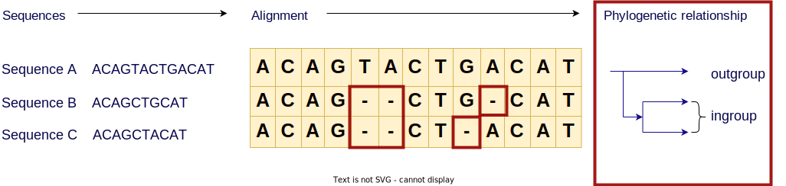

<!--
In this case I constructed this hypothetical example 
where the only differences are in these deletion events
-->

#### And we can infer evolutionary relationships between those sequences 
- ingroup (1 difference)
- outgroup (3 differences)

<!--
In this case I constructed this hypothetical example 
where the only differences are in these deletion events
-->
# BACKGROUND: Sequence alignment
<!-- paginate: hold -->


#### And we can infer evolutionary relationships between those sequences 
- ingroup (1 difference)
- outgroup (3 differences)
- likely unobserved ancestor sequence
- how long ago sequences likely diverged

# BACKGROUND: Sequence alignment
<!-- paginate: hold -->


##### Sequence alignment + phylogeny is a **time machine** for homologous sequences

<!-- ... that descend from common ancestors-->

# PROBLEM: Sequence alignment is a big job
<!-- paginate: true -->

- Historically sequence alignment was done manually, like a really big evil jigsaw puzzle
- Since 1970$_1$ this has been a computational problem
- The task is to compare **each** letter in **each** sequence with **all** the letters of **every** other sequence.


<!-- _footer: "<sup>1</sup>[Needleman & Wunsch, 1970  doi.org/10.1016/0022-2836(70)90057-4](https://doi.org/10.1016/0022-2836(70)90057-4)" -->

# PROBLEM: Exhaustive sequence alignment takes time

The time complexity of sequence alignment is can be expressed in big-O notation

## $O(L^n)$

Where: 
- $L$ is the average length of the sequence
- $n$ is the number of sequences


# Large computation problems take

- ## Time :watch: 
- ## Money :heavy_dollar_sign:
- ## Energy :bulb: 

<!-- _footer: '* GISAID had 5.1M copies of SARS-CoV-2 sequences as of Oct 2021 [www.nature.com/articles/s41588-022-01033-y](https://www.nature.com/articles/s41588-022-01033-y)' -->

<!-- 
Note: The genes that produce the 2 subunits of RuBisCO are ~1500 and ~500 bp respectively
but the genomes of species that can make RuBisCO can be 1.5 mbp - 150 gbp long
-->
# 
<!-- _paginate: hold -->


<!-- _footer: "Created with the Imgflip Meme Generator"-->
# 
<!-- _paginate: hold -->


<!-- _footer: "Created with the Imgflip Meme Generator"-->
# STATE OF THE ART: Progressive alignment

<div class="two_columns">
  <div>

**Method**:
1. start with a phylogeny

  </div>
  <div>

## Phylogenetic tree


  </div>
</div>


# STATE OF THE ART: Progressive alignment
<!-- _paginate: hold -->

<div class="two_columns">
  <div>
  
**Method**:
1. start with a phylogeny
1. align the **most closely related** sequences into a statistical model called a profile

  </div>
  <div>


  </div>
</div>


# STATE OF THE ART: Progressive alignment
<!-- _paginate: hold -->

<div class="two_columns">
  <div>
  
**Method**:
1. start with a phylogeny
1. align the most closely related sequences into a statistical model called a profile
1. align that profile with the **next** most closely related sequence 

  </div>
  <div>

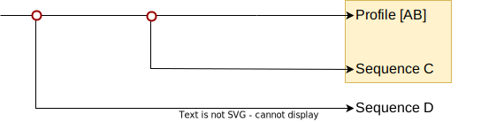

  </div>
</div>


# STATE OF THE ART: Progressive alignment
<!-- _paginate: hold -->

<div class="two_columns">
  <div>
  
**Method**:
1. start with a phylogeny
1. align the most closely related sequences into a statistical model called a profile
1. align that profile with the next most closely related sequence 
1. REPEAT until you have finished aligning **all the sequences**

  </div>
  <div>


  </div>
</div>

# STATE OF THE ART: Progressive alignment
<!-- _paginate: hold -->

<div class="two_columns">
  <div>
  
**Method**:
1. start with a phylogeny
1. align the most closely related sequences into a statistical model called a profile
1. align that profile with the next most closely related sequence 
1. REPEAT until you have finished aligning all the sequences
<br/>

  </div>
  <div>


<br/>
This reduces the order of $Work(L^n)$ $\rightarrow$ $Work(i.L^2)$ 
- Where $i$ is the number of internal nodes originally in the tree 
  - binary tree: $i=(n-1)$
  - $Work_{progressive}(n-1.L^2)$

<br/>

## ... That is a lot less $Work$ 

  </div>
</div>


<!-- 
Progressive alignment with a guide tree is used because it gives better results because insertion deletion events occur on the tree.  
So the statistical performance of this approach is better than alternative methods. 
-->

# Progressive multiple sequence alignment

# 
<!-- _paginate: hold -->
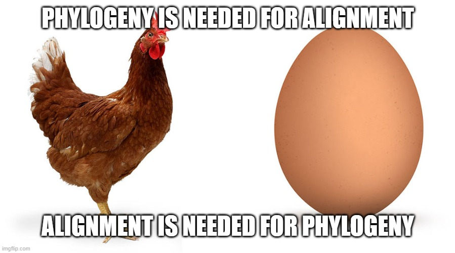

<!-- _footer: "Created with the Imgflip Meme Generator"-->

# The problem space

Sequence alignment is sensitive to 
- The **length** of sequences to be aligned
- The **number** of sequences to be aligned
- the “ Chicken and Egg ” problem

</hr>

An ideal strategy would reduce 
- The **length** of sequences to be aligned
- The **number** of sequences to be aligned
- Requirement to know the phylogeny in advance

<!-- 
Can we reproduce the same statistical behaviour while doing less work 
-->

# What if we could **quickly** remove similar regions?


<br/>

### We could pass the alignment method, just the fragments that differ

# Sequence alignment using De Bruijn Graphs

My work builds upon the work by **Xingjian Leng**$_1$ , under the supervision of **Dr. Yu Lin** and **Prof. Gavin Huttley**. 

Xingjian tackled the length problem using de Bruijn graphs 


de Bruijn graphs can be used for sequence assembly from reads  

... but they can also be used for sequence alignment

<!-- _footer: "$^1$Leng, Xingjian. ‘Sequence Alignment Using De Bruijn Graphs’. Australian National University, 2022 "-->

# De Bruijn graphs


## Building a De Bruijn graph is O(nL)$ 

#### This “Work” scales linearly not exponentially.

Consider the following sequence.  We'll construct a de Bruijn graph of order 3:


# De Bruijn graphs
<!-- _paginate: hold -->

## Building a De Bruijn graph is $O(nL)$ 

#### This “Work” scales linearly not exponentially.

Consider the following sequence.  We'll construct a de Bruijn graph of order 3:

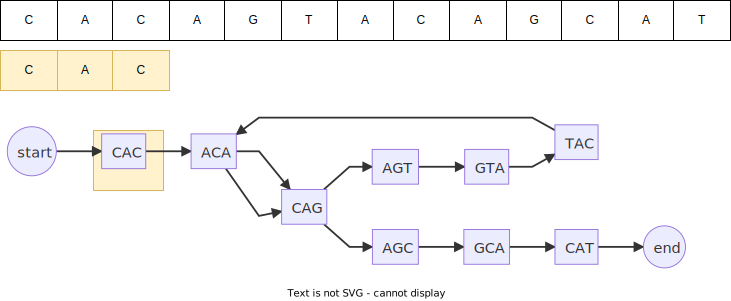

# De Bruijn graphs
<!-- _paginate: hold -->

## Building a De Bruijn graph is $O(nL)$ 

#### This “Work” scales linearly not exponentially.

Consider the following sequence.  We'll construct a de Bruijn graph of order 3:

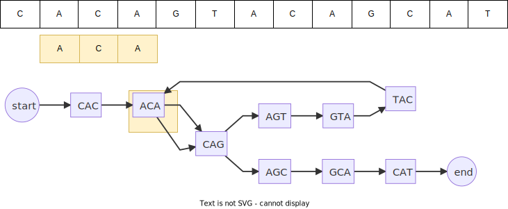

# De Bruijn graphs
<!-- _paginate: hold -->

## Building a De Bruijn graph is $O(nL)$ 

#### This “Work” scales linearly not exponentially.

Consider the following sequence.  We'll construct a de Bruijn graph of order 3:


# Reducing the **length** of fragments to be aligned

|||||||||||||||
|--|---|---|---|---|---|---|---|---|---|---|---|---|---|
|**Seqence A** | C | A | C | A | G | T | A | C | **G** | G | C | A | T |
|**Seqence B** | C | A | C | A | G | T | A | C | **T** | G | C | A | T |

Produces the following de Bruijn graphs

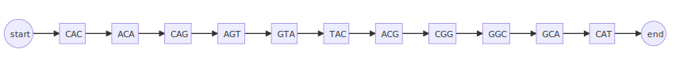


If we combine both sequences into a single de Bruijn graph, it will develop **“bubbles”** where regions are different.

# Reducing the **length** of fragments to be aligned
<!-- _paginate: hold -->

|||||||||||||||
|--|---|---|---|---|---|---|---|---|---|---|---|---|---|
|**Seqence A** | C | A | C | A | G | T | A | C | **G** | G | C | A | T |
|**Seqence B** | C | A | C | A | G | T | A | C | **T** | G | C | A | T |

Produces the following de Bruijn graphs


If we combine both sequences into a single de Bruijn graph, it will develop **“bubbles”** where regions are different.


# Reducing the **length** of fragments to be aligned
<!-- _paginate: hold -->


can be transformed to the partial order graph

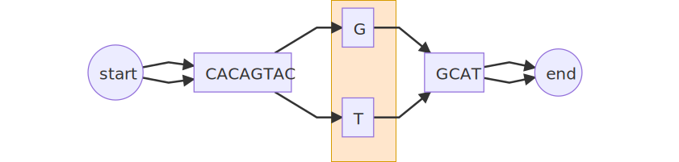

We have reduced $(14\times 14)=196$ 
to $(1 \times 1)=1$ 

## **196x** less “work”.

# De Bruijn **multiple** sequence alignment

Consider aligning 4 sequences

  

We have reduced $(13\times 13+13\times 16+16\times 16)=633$ for a progressive alignment
to $(1\times 1+1\times 4+4\times 5) = 24$ 

## **26x** less “work” than a progressive alignment


# Taking the de Bruijn graph to the next level

<br/>
<br/>

## We have changed the length of fragments 
<br/>
<br/>

## Can we change the **number** of fragments to align?

# Reducing the **number** of fragments to be aligned

Consider this partial order graph containing 4 sequences
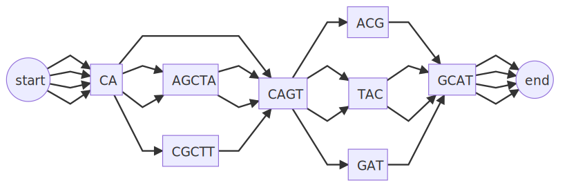

# Reducing the **number** of fragments to be aligned
<!-- _paginate: hold -->

Consider this partial order graph containing 4 sequences


Sequences in bubbles can **braid** together

# Reducing the **number** of fragments to be aligned
<!-- _paginate: hold -->


| progressive alignment | reduce length | reduce number |
|---|---|---|
$(14\times 18)+2(18\times 18)$ | $3(5^2) + 3(3^2)$ | $5^2 + 2(3^2)$ |
900 | 102 (**>8x** less work) | 43 (**>20x** less work)|

# Reduce the dependence on the phylogeny


1. order fragments by depth of bubble
2. start with deepest set of fragments
3. align progressively


Align without needing to know in advance the phylogeny

# Reduce the dependence on the phylogeny
<!-- _paginate: hold -->


# Reduce the dependence on the phylogeny
<!-- _paginate: hold -->


# Reduce the dependence on the phylogeny
<!-- _paginate: hold -->


# Reduce the dependence on the phylogeny
<!-- _paginate: hold -->


# Reduce the dependence on the phylogeny
<!-- _paginate: hold -->


## Alignment completed without requiring a phylogeny

# Project Aims
1. construct **de Bruijn graph** from sequences
2. identify **bubbles** in the graph
3. extend **braids** using _Karlin and Altschul_$_1$ statistics
4. compare longest **braids** with ungapped _Smith-Waterman_$_2$
5. contrast performance

<!-- _footer: "<sup>1</sup>[Karlin & Altschul, 1990  doi.org/10.1073/pnas.87.6.2264](https://doi.org/10.1073/pnas.87.6.2264) <br/> <sup>2</sup>[Smith & Waterman, 1981  doi.org/10.1016/0022-2836(81)90087-5](10.1016/0022-2836(81)90087-5)"-->


# Construct de Bruijn graph from sequences

**Why**: Project multiple unaligned sequences into de Bruijn graph space
**How**: Development of a Python library with unit tests and sample data
**Results**: Library madb is able to construct de Bruijn graphs from cogent3 unaligned sequences, or dicts of strings, and to render the graph in mermaid or graphviz format, and render a mermaid graph as the results of a jupyter notebook cell.


# identify **bubbles** in the graph

**Why**: Determine the regions of the graph where sequences differ
**How**: identify the beginnings of a divergence in the graph, and follow any sequence to the next node containing all the sequences that diverged
**Result**: I can identify the number of bubbles, and order them by depth, however the function that returns the sequences along the sides of the bubble is incorrectly adding characters from the preceding braid
**Conclusion**: This is sufficient to start alignment but the greedy nature of the bubble sequence identification makes this function less efficient than it needs to be


# extend **braids** using _Karlin and Altschul_$_1$ statistics

**Why**: Construct braids from non bubble segments, or segments where the bubbles have equal sides and the changes are not significant per the Karlin statistic
**How**: Use the start of any bubble with equal length sides to identify a braid end, and the end of the previous bubble that is not equal length to identify a braid start if bubbles withing the braid are equal length then apply the karlin statistic to determine if the bubble should be removed from the list of bubbles
**Result**: The braid function is currently not correctly identifying all the characters it should
**Conclusion**: I don't need to have braids to align, but we do to identify the longest braid

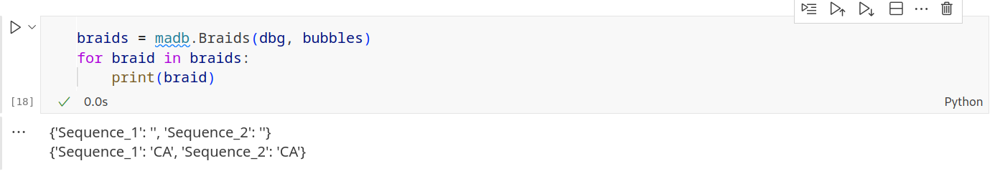

<!-- _footer: "<sup>1</sup>[Karlin & Altschul, 1990  doi.org/10.1073/pnas.87.6.2264](https://doi.org/10.1073/pnas.87.6.2264)"-->

# compare longest **braids** with ungapped _Smith-Waterman_$_1$

**Why**: An ungapped Smith-Waterman function should return the longest local alignment in any pair of sequences, this should be the same as the longest braid in a de Bruijn graph
**How**: Implemented smith-waterman function in madb library
**Result**: I need to fix the braid function above to be able to compare the longest braid with the ungapped Smith-Waterman
**Conclusion**: If we can get the braid function working then we can test the performance for de Bruijn graphs to find all local alignments versus  Smith-Watermans ability to find just the longest.

<!-- _footer: "<sup>1</sup>[Smith & Waterman, 1981  doi.org/10.1016/0022-2836(81)90087-5](10.1016/0022-2836(81)90087-5)"-->

# contrast performance

**Why**: I can compare the results of the de Bruijn graph finding all local alignments with Smith-Waterman finding the optimal(longest) to see if the de Bruijn graph method is more efficient
**How**: TBD
**Result**: TBD
**Conclusion**: TBD


# Summary

It's quite clear that this method of using de Bruijn graphs to **reduce both length and number** of fragments to align in these synthetic examples offers a significant performance improvement over reducing just the length, and further significant improvements over the state of the art; progressive alignment.

de Bruijn graphs appear to break the 40 year tautology at the heart of **sequence alignment**, and **phylogenetic reconstruction**.

It is worth perservering with this method to see if it can be applied to evolved sequences.

 
### It looks like this method will make some very big questions tractable

# Future directions

- From first principals, in sequences evolved in an order consistent with data from a progressive tree, **to show that the bubbles in the graph correspond to nodes in a tree** and are similarly ordered
- Using data with known topologies and unambiguous evolution
  - show that the algorithm has **statistical performance** consistent with progressive alignment
  - show that the algorithm has **superior computational performance wrt time and memory** to progressive alignment
- Investigate sequences in species subject to **lateral gene flow** which progressive alignment struggles with

# Thanks

<div class="two_columns">
  <div>

- Gavin Huttley
- Vijini Mallawaarachchi
- Yu Lin
- Xinjian Leng

</div>
<div>

## ... and the Huttleylab


</div>

# Questions & Answers
<!-- paginate: skip-->

- [AIMS](#project-aims)          
- [BACKGROUND: Sequence alignment](#background-sequence-alignment)
- [CASES](#3-instructive-cases-of-sequence-alignment)
- [PROBLEM](#problem-sequence-alignment-is-a-big-job)
- [STATE OF THE ART](#state-of-the-art-progressive-alignment)
- [Alignment using De Bruijn Graphs](#sequence-alignment-using-de-bruijn-graphs)
- [Reduce **length** of fragments](#reducing-the-length-of-fragments-to-be-aligned)
- [RESULTS](#result-reducing-the-number-of-fragments-to-be-aligned)
  - [Reduce **number** of fragments](#result-reducing-the-number-of-fragments-to-be-aligned)
  - [Break **phylogeny** dependence](#result-reduce-the-dependence-on-the-phylogeny)
  - [work **statistics**](#result-work-statistic-from-partial-order-graphs)
- [SUMMARY](#summary)
- [FUTURE DIRECTIONS](#future-directions)
- [SUPPLEMENTARY](#supplementary)

[1](#project-aims) [2](#background-sequence-alignment) [3](#3-instructive-cases-of-sequence-alignment) [4](#case-evolution-of-rubisco) [5](#case-trajectory-of-the-spike-protein-of-sars-cov-2) [6](#case-our-immediate-family-tree)[7](#problem-sequence-alignment-is-a-big-job) [8](#problem-exhaustive-sequence-alignment-takes-time) [9](#reframe-work-increases-as-data-grows) [10](#problem-the-scale-of-our-3-cases) [11](#state-of-the-art-progressive-alignment) [12](#progressive-multiple-sequence-alignment) [13](#the-problem-space) [14](#what-if-we-could-quickly-remove-similar-regions) [15](#sequence-alignment-using-de-bruijn-graphs) [16](#de-bruijn-graphs) [17](#reducing-the-length-of-fragments-to-be-aligned)
[18](#de-bruijn-multiple-sequence-alignment) [19](#taking-the-de-bruijn-graph-to-the-next-level) [20](#result-reducing-the-number-of-fragments-to-be-aligned) [21](#result-reduce-the-dependence-on-the-phylogeny) [22](#result-work-statistic-from-partial-order-graphs) [23](#summary) [24](#future-directions) [25](#thanks)


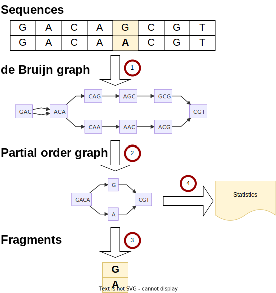


# Citations

- Leng, Xingjian (2023), ‘Sequence Alignment Using De Bruijn Graphs’. Australian National University

- [Needleman & Wunsch (1970), 'A general method applicable to the search for similarities in the amino acid sequence of two proteins'  doi.org/10.1016/0022-2836(70)90057-4, 2010](https://doi.org/10.1016/0022-2836(70)90057-4)

- [Whitney, Houtz, and Alonso (2010), ‘Advancing Our Understanding and Capacity to Engineer Nature’s CO2-Sequestering Enzyme, Rubisco’ DOI: 10.1104/pp.110.164814](https://pubmed.ncbi.nlm.nih.gov/20974895/)


# Supplementary
<!-- paginate: skip -->

<div class="two_columns">
<div>
<blockquote>
<p>Abandon all hope ye who pass this point</p>

<cite>Tolkein ... probably</cite>
</blockquote>
</div>
<div>

- [de Bruijn graph alignment](#de-bruijn-graph-alignment)
- [sample data sources](#sample-data-sources)
- [Bubbles in real data denote phylogenetic nodes](#bubbles-in-real-data-denote-phylogenetic-nodes)
- unit tests against edge case sequence alignments
  - long sequences
  - numerous sequences
  - [cyclic sequences](#cyclic-sequences)
  - bubbles within bubbles
  - sequential bubbles


</div>

# de Bruijn graph alignment

- Construct a de Bruijn graph from sequences
- Project de Bruijn graph to a partial order graph
- Emit fragments from the partial order graph
- Align fragments 
- Reconstitute original sequences with the aligned fragments


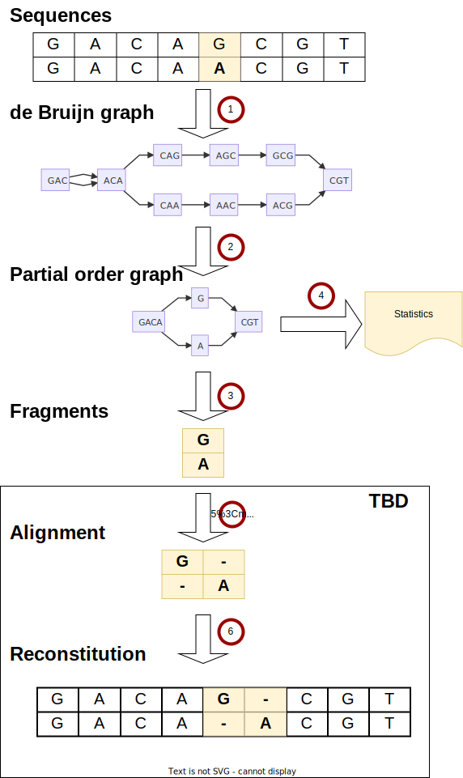

# Bubbles in real data denote phylogenetic nodes
<!-- paginate: skip -->
[<<Back to Supplementary](#supplementary)

We can show in a simple case this is true, but we need to show it is true in general

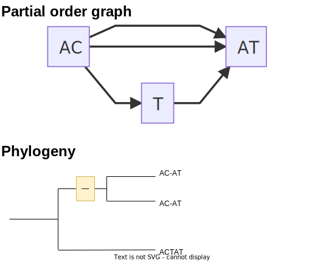

### HYPOTHESIS: One side of a bubble is a clade

# Unit tests
<!-- paginate: skip -->
[<<Back to Supplementary](#supplementary)

library against edge case sequence alignments
      * long sequences
      * numerous sequences
      * [cyclic sequences](#cyclic-sequences)
      * bubbles within bubbles
      * sequential bubbles

# cyclic sequences

```python
def test_pog_cycle(output_dir: Path):
    dbg = dbg_align.DeBrujinGraph(3,cogent3.DNA)
    dbg.add_sequence({
        "seq1": "ACAGTACGGCAT", 
        "seq2": "ACAGTACTGGCAT", 
        "seq3":"ACAGCGCGCAT" # contains cycle
        })
    with open(output_dir / "cycle.md", "w") as f:
        f.write("```mermaid\n")
        f.write(dbg.to_mermaid())
        f.write("```")   
    assert dbg.has_cycles()
    assert len(dbg) == 3
    assert dbg.names() == ["seq1", "seq2", "seq3"]
    assert dbg["seq3"] == "ACAGCGCGCAT" # contains cycle
     
    dbg.to_pog()
    # write mermaid out to testout folder
    with open(output_dir / "cycle_compressed.md", "w") as f:
        f.write("```mermaid\n")
        f.write(dbg.to_mermaid())
        f.write("```")
```
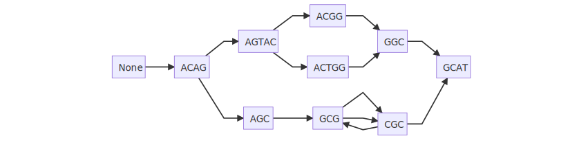
# Sample data sources

- BRCA1_divergent: BRCA1 gene divergent sample of 7 chosen from among 56 mammal species
- BRCA1_hominae:  BRCA1 gene from 4 hominae 
- SARS-CoV-2: 22 SARS-CoV-2 genomes
- IBD_phage: IBD phage components (https://doi.org/10.1016/j.cell.2015.01.002) |
- Ocean_phage: Tara oceans phage components (https://doi.org/10.1126/science.