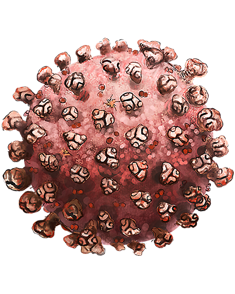
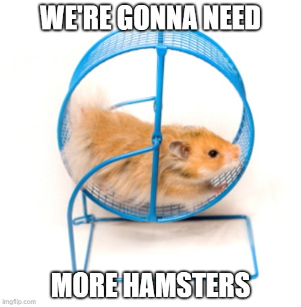
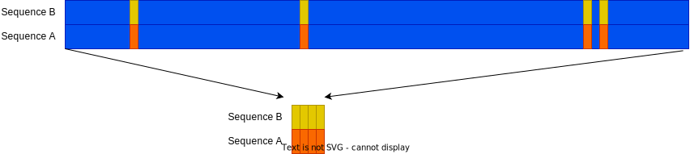
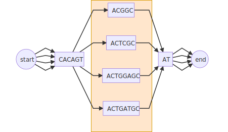
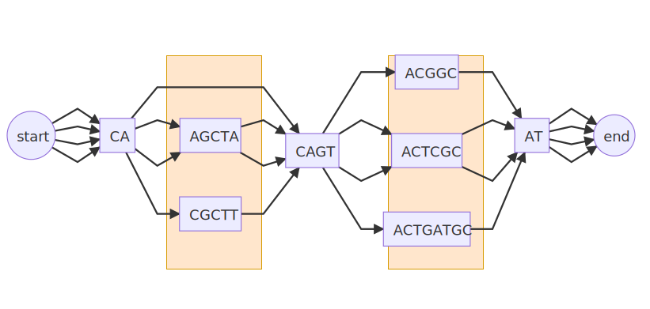
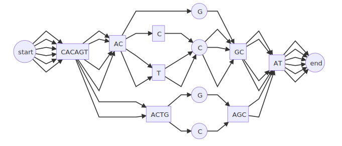

## BIOL8706: Dividing and conquering sequence alignment using De Bruijn Graphs
<!-- paginate: skip -->
<!-- _class: coverpage -->

- Student: Richard Morris
- Huttley lab, Australian National University
- Supervisors: Gavin Huttley, Vijini Mallawaarachchi

# Introduction to sequence alignment
<!-- paginate: true -->
<!-- header: _Dividing and conquering sequence alignment using De Bruijn Graphs_ -->

Given we can sequence genomes of different organisms.  

Sequence A: `ATGCATAC` Sequence B: `ATGTAC`

We can compare sequences.  But first we have to align these sequences to identify common regions

To investigate this difference, we need to identify regions that are different, and regions that are similar.  To do that we will put these two sequences in a data structure called a partial order graph

# Sequence as a partial order graph
Our alignment 

can be represented as the following partial order graph, showing each node and the direction of the alignment. 

# Extracting regions from the partial order graph

  

    By collecting together adjacent nodes with the same number of edges we can simplify that to 

  

  

  <strong>Now we can make some claims about which regions are present in both sequences</strong>

  eg: If those regions encoded for genes, then we can make some claims about organism genotype.

  

  

$$\begin{array}{c|c|c|c}
& \boxed{ATG} & \boxed{CA} & \boxed{TAC} \\
\hline \text{Sequence A} & \checkmark & \checkmark & \checkmark \\
\hline \text{Sequence B} & \checkmark & \oslash & \checkmark \\
\end{array}$$
  

# Why is multiple sequence alignment (MSA) important?

  

#### Alignment of eg: a viral genome allows us to:
  * Identify conserved regions for vaccine/drug development
  * Identify changes in function to make predictions about the virus' behaviour
  * Identify and prepare for emerging variants

  

  

    
    Alignment of S mutation points of SARS-CoV-2 variants
  

# Why is MSA so computationally expensive?

- An exact solution has an order complexity of $O(L^n)$ 
  - **L** is the length of the sequence 
  - **n** is the number of sequences

# MSA for SARS-CoV-2 genomes?

  

## SARS-CoV-2 
- length: **~29,903** bp
- number: **over 5 million** (as of March 2022) 1
- $O(29,903^\text{over 5 million})$ is a **very large number**
##### **Required: a method to align large numbers of small sequences**

  

  

    <figure>
      
      <figcaption>Fig 1: Artists rendition of SARS-CoV-2</figcaption>
    </figure>
  

<!-- _footer: "1 [doi.org/10.1038/s41588-022-01033-y](doi.org/10.1038/s41588-022-01033-y) | Fig 1 [doi.org/10.7875/togopic.2020.199](doi.org/10.7875/togopic.2020.199)"-->
# MSA for great apes genomes?

  

## The great apes
- length: **~3 billion** bp
- number: 5 
- $O(3 Billion^\text{5})$ is also a very large number.
- However great ape genomes are 97+% identical1
##### **Required: a method to identify the few different regions in very long similar sequences**
  

  

    <figure>
      
      <figcaption>The family tree of great apes</figcaption>
    </figure>
  

<!-- _footer: "1 [citation needed]()"--> 

# Computation requires energy

  

## The human genome moonshot alignment
- Calculations performed by chatGPT
- length: ~3 billion bp
- number: ~8 billion
- $O(3 B^\text{8B})$ calculations
- Supercomputers perform $10^{18}$ FLOPs per second
- at an efficiency of ~30 billion FLOPs/watt
- assuming the order unit is one FLOP

= ${{3,000,000,000}^{8,000,000,000}/{30,000,000,000}}$ watts

The milky way over it's 13.6 Billion year lifetime it can be calculated has only generated $3.8x10^{37}$ watts

#### **So without a more efficient algorithm we'll need the energy of 216 million more galaxies to perform this calculation**
  

  

    <figure>
      
    </figure>
  

<!-- _footer: "Created with the Imgflip Meme Generator"-->

# Required: a more efficient method to align 
  - large numbers of small sequences
  - small numbers of very similar long sequences

# Sequence alignment order complexity

## Pairwise sequence alignment
- Compare every letter in one sequence to every letter in the other
- order complexity of $O(mn)$ 
  - where **m** and **n** are lengths of the sequences
## Multiple sequence alignment (MSA)
- Perform a pairwise alignment of every sequence to every other sequence
- order complexity of $O(L^n)$ 
  - where **L** is the length of the sequences 
  - **n** is the number of sequences

<!-- The pairwise algorithms are both actually O(mn) where m and n are the lengths of the 2 sequences. -->

# Pairwise sequence alignment methods: $O(mn)$

- Needlemann-Wunsch algorithm: global alignment for highly similar sequences
    - scoring system that penalises gaps and mismatches
- Smith-Waterman algorithm: better for local alignment to find conserved domains
    - allows for alignment to reset when the score falls to 0

# Multiple sequence alignment (MAS) strategies  
- Exact alignment 
    - $O(L^n)$
- Progressive alignment eg: ClustalW
    - create a guide tree $O(n^2.L^2)$ 
    - Progressively align pairs most closely related to profiles, and then align profiles $O(n^2.L)$
- Iterative methods  eg: MUSCLE, T-Coffee, MAAFT
    - $O(n^2.L^2)$
    - create an preliminary fast less accurate alignment 
    - iteratively improve alignment using some scoring function
    - Complete when some convergence criterion is met
- Hidden markov models $O(nL) + O(LM)$ (M is the number of states in the model)
    - eg: HMMER
    - create a statical model of the transition between states 
    - Determine likely alignment based on the model

# The chicken and egg problem of MSA

<!-- _footer: "Created with the Imgflip Meme Generator"-->

# What if we could quickly remove regions that are similar?

### We'd be able to focus our computational resources on just the regions that are different.

# Sequence alignment using De Bruijn Graphs

This work builds on the work by Xingjian Leng in a 12 month undergraduate research project in 2022, under the supervision of Dr. Yu Lin and Prof. Gavin Huttley. 

That project focused on the alignment of closely related viral genomes, with a particular emphasis on SARS-CoV-2. The method is based on the construction and utilization of de Bruijn graphs for both pairwise and multiple sequence alignment tasks.

# De Bruijn graphs

A De Bruijn graph is a directed graph that represents unique overlapping subsequences (or k-mers) at the nodes.  This structure is an efficient way to identify sequence overlaps, and common regions.  

Building a De Bruijn graph has an order complexity of $O(nL)$ 

# Overlapping k-mers

Consider the DNA sequence $\boxed{CACAGTACGGCAT}$ when broken into 3 character overlapping subsequences (or 3-mers) looks like this:

$
\boxed{CAC}\quad\quad\quad\quad\quad\quad \boxed{ACG} \\
\quad \boxed{ACA}\quad\quad\quad\quad\quad\quad \boxed{CGG} \\
\quad\quad \boxed{CAG}\quad\quad\quad\quad\quad\quad \boxed{GGC} \\
\quad\quad\quad \boxed{AGT} \quad\quad\quad\quad\quad\quad \boxed{GCA}\\
\quad\quad\quad\quad \boxed{GTA}\quad\quad\quad\quad\quad\quad \boxed{CAT}\\
\quad\quad\quad\quad\quad \boxed{TAC}\\
$
# De Bruijn graphs

When we represent that as a de Bruijn graph it looks like this:

# A second sequence

Consider we want to align that sequence $\boxed{CACAGTAC\boxed{G}GCAT}$ to the very similar sequence $\boxed{CACAGTAC\boxed{T}CGCAT}$

Which as a De Bruijn graph looks like this:

# De Bruijn pairwise alignment

#### Sequence A: 

#### Sequence B: 

If we combine both sequences into a single de Bruijn graph, we can easily identify the regions that are similar and the regions that are different.

# Resolving the graph

We can collect nodes with 2 edge, or 1 edge into single nodes, and we can see the regions that are similar and the regions that are different.

Now we can use a traditional algorithm to align the regions $\boxed{AC\boxed{G}GC}$ and $\boxed{AC\boxed{T}GC}$, and we've reduced $O(14^2)$ down to $O(5^2)$ = **7.8x** less work.

# De Bruijn multiple sequence alignment

And we can extend this to multiple sequences.  Consider aligning the following sequences
`CACAGTACGGCAT` `CACAGTACTGCAT` `CACAGTACTGGAGCAT`& `CACAGTACTGATGCAT`

  

  

  

  

    Now we've reduced O(13x13x16x16) down to O(6x6x8x8) = <strong>18.8x</strong> less work
  

# Reducing the horizontal complexity of the problem

- Horizontal component of the problem is the length (L) of the sequences to be aligned
- recall an exact alignment has an order complexity of $O(L^n)$
- if we reduce the length of the sequences we need to align we reduce L

#### **How about n?**

# Reducing the vertical complexity of the problem

- Vertical component of the problem is the number of sequences to be aligned (n)

- Any matches or deletions reduces the number of sequences we need to align

# Project aims

* Investigate the use of De Bruijn graphs to identify regions of dissimilarity for traditional alignment algorithms
* Build a python library for implementing De Bruijn Graph Multi-sequence alignment
    * Resolve the De Bruijn graph to a partial order graph to reduce horizontal complexity
    * Add bitmaps to nodes identifying sequences that contain that node
    * Use bitmaps to reduce vertical complexity
    * investigate using bitmaps for identifying reverse compliment regions
    * investigate using bitmaps for identifying sequence distance
* Investigate measures of performance and accuracy
* Stretch goals
    * Quantify **performance** against traditional methods
    * Quantify **accuracy** against traditional methods

# Results 

## **TBD...**

# Discussion

## **TBD...**

# Future directions

Investigate the potential of using De Bruijn Graphs to;

- identify reverse compliment regions from a DBG
- identify phylogeny from a DBG using bitmaps to measure distance 
- investigate phylogeny of conserved regions in species with lateral gene flow

# Thanks

- Gavin Huttley
- Yu Lin
- Vijini Mallawaarachchi
- Xinjian Leng
- Huttley lab

# Questions