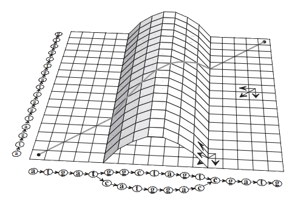

# MARP feature sandbox

- [x] checkbox
- ```python
  print("Hello world")
  ```
- katex example $x^2$
- mermaid example 
<div class="mermaid">
graph LR
   s((start))-->CAC --> ACA --> CAG --> AGT --> GTA --> TAC{{TAC}} --> ACA --> CAG --> AGC -->GCA{{GCA}} --> CAT -->e((end))
   s-->CAC --> ACA --> CAG --> AGT --> GTA --> TAC --> ACT --> CTC --> TCG --> GCA --> CAT -->e
</div>
- [Jump to slide 3](#3)
-  <sub>1</sub>
<!-- _footer: "<sub>1</sub> [doi.org/10.1093/bioinformatics/18.3.452 figure 4b](https://doi.org/10.1093/bioinformatics/18.3.452)" 
-->

<div class="columns">
  <div>
  A
  </div>
  <div>
  B
  </div>
</div>

---
