## BIOL8706: Dividing and conquering sequence alignment using De Bruijn Graphs
<!-- paginate: skip -->
<!-- _class: coverpage -->

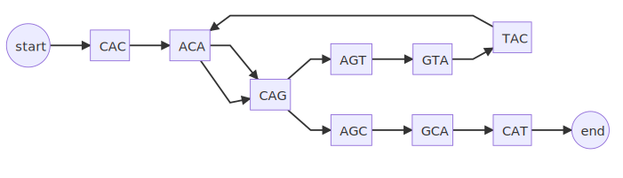
- Student: Richard Morris
- Huttley lab, Australian National University
- Supervisors: Gavin Huttley, Vijini Mallawaarachchi 

# Project aims
<!-- paginate: true -->
<!-- header: <a href="#questions--answers" style="color: inherit; text-decoration: none;">_Dividing and conquering sequence alignment using De Bruijn Graphs_</a>-->

<br/>

Build prototype
1. construct **de Bruijn graph** from sequences
2. project de Bruijn graph to a **partial order graph**
3. emit **fragments** from the partial order graph
4. statistics that **estimate work required** for alignment


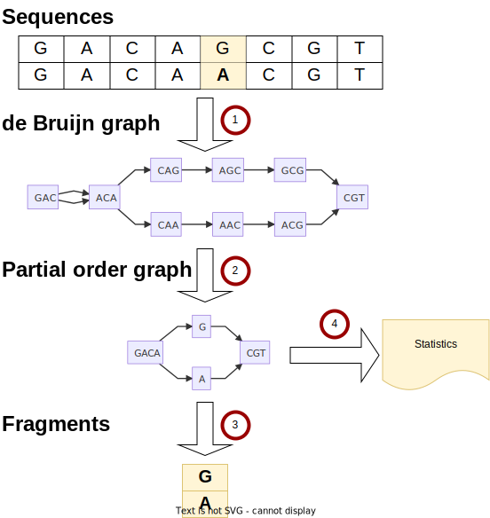

# BACKGROUND: Sequence alignment

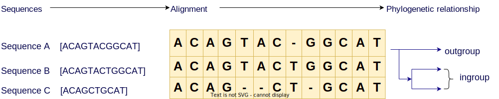

# BACKGROUND: Sequence alignment
<!-- paginate: hold -->


#### Start with a set of DNA sequences to be aligned

# BACKGROUND: Sequence alignment

<!--Note these sequences are all different lengths -->

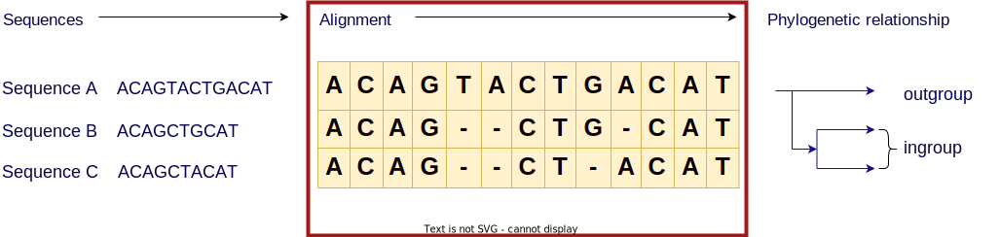

#### align those sequences

# BACKGROUND: Sequence alignment

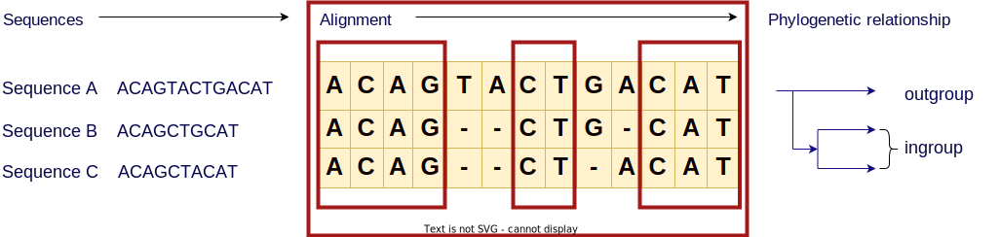

#### By lining up regions that are similar

# BACKGROUND: Sequence alignment

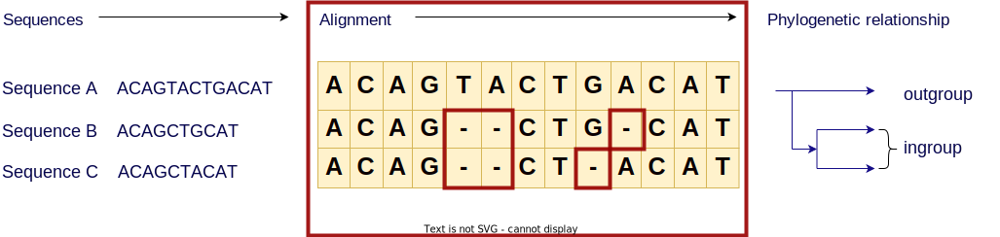

#### Noting those that are different

# BACKGROUND: Sequence alignment

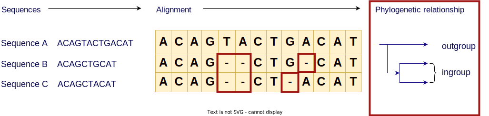

<!--
In this case I constructed this hypothetical example 
where the only differences are in these deletion events
-->

#### And we can infer evolutionary relationships between those sequences 
- ingroup (1 difference)
- outgroup (3 differences)

<!--
In this case I constructed this hypothetical example 
where the only differences are in these deletion events
-->
# BACKGROUND: Sequence alignment
<!-- paginate: hold -->

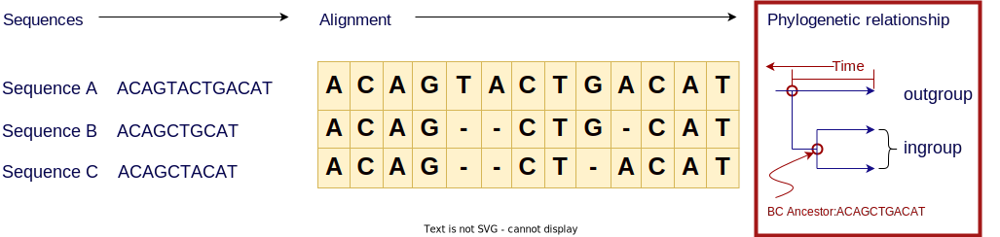

#### And we can infer evolutionary relationships between those sequences 
- ingroup (1 difference)
- outgroup (3 differences)
- likely unobserved ancestor sequence
- how long ago sequences likely diverged

# BACKGROUND: Sequence alignment
<!-- paginate: hold -->


##### Sequence alignment + phylogeny is a **time machine** for homologous sequences

<!-- ... that descend from common ancestors-->

# 3 instructive cases of sequence alignment
<!-- paginate: true -->

- Evolution of RuBisCO
- Trajectory of the SARS-CoV-2 virus
- Our own Family tree

<!--
These examples are not just random useful things to know 
but they highlight the computational problem 
that motivates the need to find a better way to do sequence alignment
-->

# CASE: Evolution of RuBisCO


- Enzyme that converts CO₂ to organic carbon during photosynthesis
- Sequence alignment can infer it's evolutionary history
- Compare with a geological understanding of the atmosphere at that time
<br>

We can associate **features** appearing in the protein with the **environment** in which it evolved?

<!-- _footer: "[Whitney et al 2012 doi.org/10.1104/pp.110.164814](https://doi.org/10.1104/pp.110.164814) "-->

<!-- This will tell us important things like RuBisCO innovations in response to different partial pressures of O₂ and CO₂-->

# CASE: Trajectory of the spike protein of SARS-CoV-2

<div class="two_columns">
  <div>

Sequence alignment 
- allows us to identify conserved regions to inform vaccine/drug development
- can help us predict the virus's trajectory
  - where it came from
  - where it is going to

  </div>
  <div>
    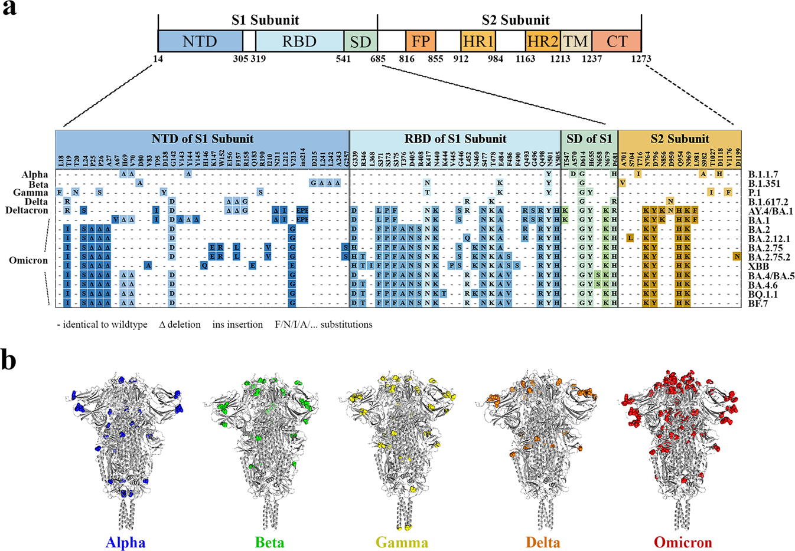
    <span>Alignment of S mutation points of SARS-CoV-2 variants</span>
  </div>

# CASE: Our immediate family tree
<div class="two_columns">
  <div>

- How do we differ from other great apes 
- How are we the same
- This has direct applications in biomedical science

  </div>
  <div>
    <figure>
      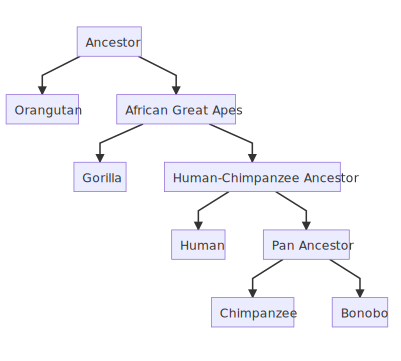
      <figcaption>The family tree of great apes</figcaption>
    </figure>
  </div>
</div>

<!-- 
This ability to decompose history can be applied to proteins like RuBisCO, it can be applied to viruses, it can be applied to our own evolution.  Alignment is integral to all of these
-->
# PROBLEM: Sequence alignment is a big job

- Historically sequence alignment was done manually, like a really big evil jigsaw puzzle
- Since 1970$_1$ this has been a computational problem
- The task is to compare **each** letter in **each** sequence with **all** the letters of **every** other sequence.

<br> 

- The terms: **each**, **all** and **every** should tell you that this will be a big job for computers too.

<!-- _footer: "[Needleman & Wunsch, 1970  doi.org/10.1016/0022-2836(70)90057-4](https://doi.org/10.1016/0022-2836(70)90057-4)" -->

# PROBLEM: Exhaustive sequence alignment takes time

A computational scientist might say that the asymptotic complexity of an exhaustive alignment is given by the following big-O notation

## $O(L^n)$

Where: 
- $L$ is the average length of the sequence
- $n$ is the number of sequences

<div><div class="quote">

<p>“Big-O tells you how code <strong>slows</strong> as data <strong>grows</strong>”</p>
<cite>Ned Batchelder</cite>
</div></div>

<!-- _footer: "[nedbatchelder.com](https://nedbatchelder.com/blog/201310/big_o_log_n.html)"-->

# REFRAME: Work **increases** as data **grows**

Let's rephrase this big-O notation as the order of $Work(L^n)$

<hr/>

| **Average length (L)** | Number of sequences (n) | $Work$ required (comparisons)|
|---|---|---|
| 1,000 | 3 | 1,000,000,000 |
| 2,000 | 3 | 8,000,000,000 |
| 3,000 | 3 | 27,000,000,000 |
| 4,000 | 3 | 64,000,000,000 |
| 5,000 | 3 | 125,000,000,000 |
| 6,000 | 3 | 216,000,000,000 |
| 7,000 | 3 | 343,000,000,000 |
| 8,000 | 3 | 512,000,000,000 |
| 9,000 | 3 | 729,000,000,000 |
|10,000 | 3 | 1,000,000,000,000 |

# REFRAME: Work **increases** as data **grows**
<!-- _paginate: hold -->

Let's rephrase this big-O notation as the order of $Work(L^n)$

<hr/>

| Average length (L)| **Number of sequences (n)** | $Work$ required (comparisons)|
|---|---|---|
| 1,000 | 2 | 1,000,000 |
| 1,000 | 3 | 1,000,000,000 |
| 1,000 | 4 | 1,000,000,000,000 |
| 1,000 | 5 | 1,000,000,000,000,000 |
| 1,000 | 6 | 1,000,000,000,000,000,000 |
| 1,000 | 7 | 1,000,000,000,000,000,000,000 |
| 1,000 | 8 | 1,000,000,000,000,000,000,000,000 |
| 1,000 | 9 | 1,000,000,000,000,000,000,000,000,000 |
| 1,000 | 10 | 1,000,000,000,000,000,000,000,000,000,000 |

<!-- I want you to notice this is just 10 sequences -->


# PROBLEM: The scale of our 3 cases

| Case | Average length (L) | Number of sequences (n) | $Work$ required ($L^n$)|
|---|---|---|---|
| RuBisCO  | 2 kbp| 350,000 | $\text{2,000}^{350,000}$|
| SARS-CoV-2 | 29 kbp | 5,000,000* | $\text{29,000}^{5,000,000}$|
| Great apes | 3 gbp | 5 | $\text{3 billion}^5$ |

</br>


## Large computation problems take

- ## Time :watch: 
- ## Money :heavy_dollar_sign:
- ## Energy :bulb: 

<!-- _footer: '* GISAID had 5.1M copies of SARS-CoV-2 sequences as of Oct 2021 [www.nature.com/articles/s41588-022-01033-y](https://www.nature.com/articles/s41588-022-01033-y)' -->

<!-- 
Note: The genes that produce the 2 subunits of RuBisCO are ~1500 and ~500 bp respectively
but the genomes of species that can make RuBisCO can be 1.5 mbp - 150 gbp long
-->
# 
<!-- _paginate: hold -->
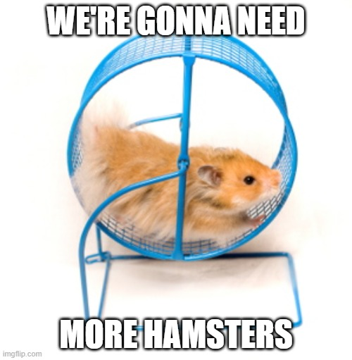

<!-- _footer: "Created with the Imgflip Meme Generator"-->
# 
<!-- _paginate: hold -->


<!-- _footer: "Created with the Imgflip Meme Generator"-->
# STATE OF THE ART: Progressive alignment

<div class="two_columns">
  <div>

**Method**:
1. start with a phylogeny

  </div>
  <div>

## Phylogenetic tree
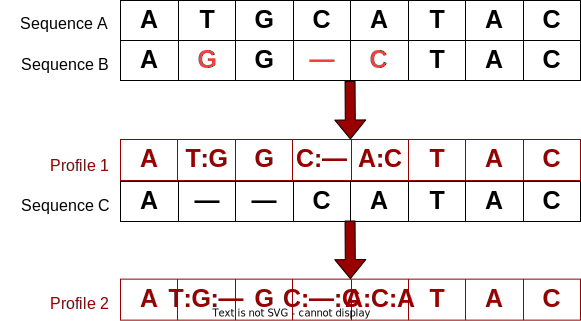

  </div>
</div>


# STATE OF THE ART: Progressive alignment
<!-- _paginate: hold -->

<div class="two_columns">
  <div>
  
**Method**:
1. start with a phylogeny
1. align the **most closely related** sequences into a statistical model called a profile

  </div>
  <div>

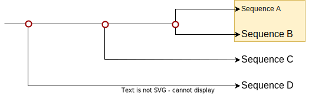

  </div>
</div>


# STATE OF THE ART: Progressive alignment
<!-- _paginate: hold -->

<div class="two_columns">
  <div>
  
**Method**:
1. start with a phylogeny
1. align the most closely related sequences into a statistical model called a profile
1. align that profile with the **next** most closely related sequence 

  </div>
  <div>

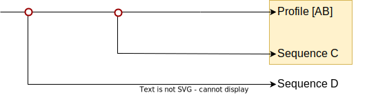

  </div>
</div>


# STATE OF THE ART: Progressive alignment
<!-- _paginate: hold -->

<div class="two_columns">
  <div>
  
**Method**:
1. start with a phylogeny
1. align the most closely related sequences into a statistical model called a profile
1. align that profile with the next most closely related sequence 
1. REPEAT until you have finished aligning **all the sequences**

  </div>
  <div>

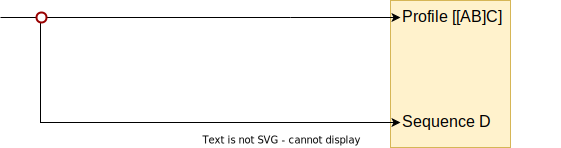

  </div>
</div>

# STATE OF THE ART: Progressive alignment
<!-- _paginate: hold -->

<div class="two_columns">
  <div>
  
**Method**:
1. start with a phylogeny
1. align the most closely related sequences into a statistical model called a profile
1. align that profile with the next most closely related sequence 
1. REPEAT until you have finished aligning all the sequences
<br/>

  </div>
  <div>


<br/>
This reduces the order of $Work(L^n)$ $\rightarrow$ $Work(i.L^2)$ 
- Where $i$ is the number of internal nodes originally in the tree 
  - binary tree: $i=(n-1)$
  - $Work_{progressive}(n-1.L^2)$

<br/>

## ... That is a lot less $Work$ 

  </div>
</div>


<!-- 
Progressive alignment with a guide tree is used because it gives better results because insertion deletion events occur on the tree.  
So the statistical performance of this approach is better than alternative methods. 
-->

# Progressive multiple sequence alignment

# 
<!-- _paginate: hold -->
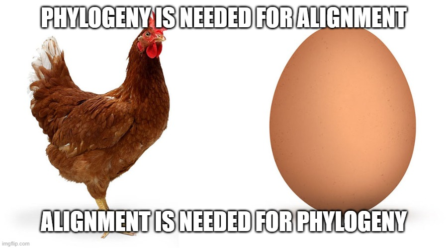

<!-- _footer: "Created with the Imgflip Meme Generator"-->

# The problem space

Sequence alignment is sensitive to 
- The **length** of sequences to be aligned
- The **number** of sequences to be aligned
- the “ Chicken and Egg ” problem

</hr>

An ideal strategy would reduce 
- The **length** of sequences to be aligned
- The **number** of sequences to be aligned
- Requirement to know the phylogeny in advance

<!-- 
Can we reproduce the same statistical behaviour while doing less work 
-->

# What if we could **quickly** remove similar regions?

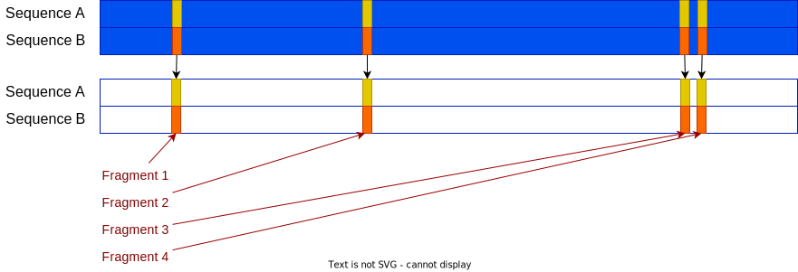

<br/>
<br/>
<br/>

### We could pass the alignment method, just the fragments that differ

# Sequence alignment using De Bruijn Graphs

My work builds upon the work by **Xingjian Leng**$_1$ , under the supervision of **Dr. Yu Lin** and **Prof. Gavin Huttley**. 

Xingjian tackled the length problem using de Bruijn graphs 


de Bruijn graphs can be used for sequence assembly from reads  

... but they can also be used for sequence alignment

<!-- _footer: "$^1$Leng, Xingjian. ‘Sequence Alignment Using De Bruijn Graphs’. Australian National University, 2022 "-->

# De Bruijn graphs


## Building a De Bruijn graph is $Work(nL)$ 

#### This “Work” scales linearly not exponentially.

Consider the following sequence.  We'll construct a de Bruijn graph of order 3:

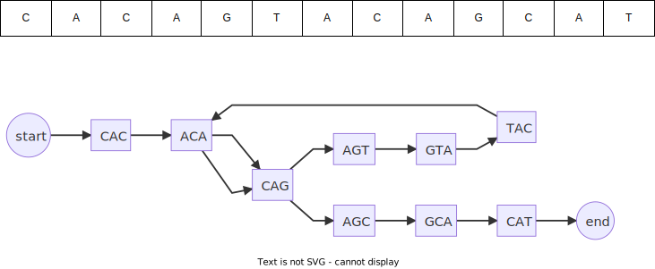

# De Bruijn graphs
<!-- _paginate: hold -->

## Building a De Bruijn graph is $Work(nL)$ 

#### This “Work” scales linearly not exponentially.

Consider the following sequence.  We'll construct a de Bruijn graph of order 3:

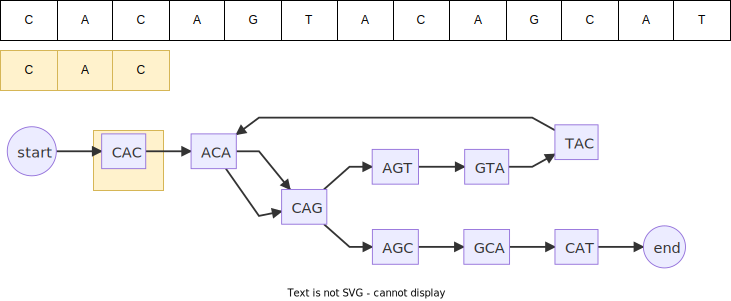

# De Bruijn graphs
<!-- _paginate: hold -->

## Building a De Bruijn graph is $Work(nL)$ 

#### This “Work” scales linearly not exponentially.

Consider the following sequence.  We'll construct a de Bruijn graph of order 3:

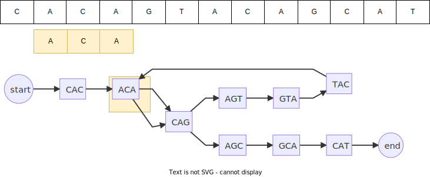

# De Bruijn graphs
<!-- _paginate: hold -->

## Building a De Bruijn graph is $Work(nL)$ 

#### This “Work” scales linearly not exponentially.

Consider the following sequence.  We'll construct a de Bruijn graph of order 3:

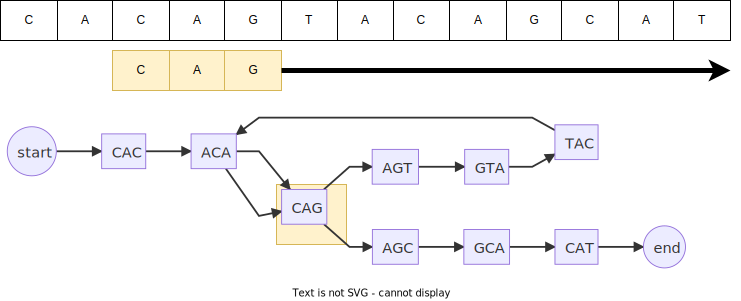

# Reducing the **length** of fragments to be aligned

|||||||||||||||
|--|---|---|---|---|---|---|---|---|---|---|---|---|---|
|Seqence A | C | A | C | A | G | T | A | C | **G** | G | C | A | T |
|Seqence B | C | A | C | A | G | T | A | C | **T** | G | C | A | T |

Produces the following de Bruijn graphs

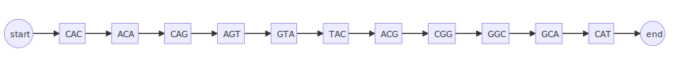
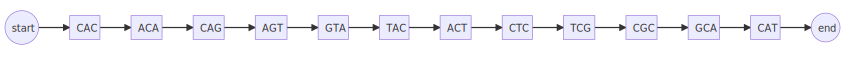

If we combine both sequences into a single de Bruijn graph, it will develop **“bubbles”** where regions are different.

# Reducing the **length** of fragments to be aligned
<!-- _paginate: hold -->

|||||||||||||||
|--|---|---|---|---|---|---|---|---|---|---|---|---|---|
|Seqence A | C | A | C | A | G | T | A | C | **G** | G | C | A | T |
|Seqence B | C | A | C | A | G | T | A | C | **T** | G | C | A | T |

Produces the following de Bruijn graphs


If we combine both sequences into a single de Bruijn graph, it will develop **“bubbles”** where regions are different.

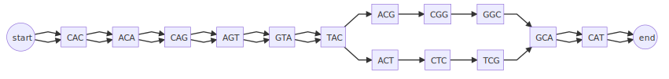

# Reducing the **length** of fragments to be aligned
<!-- _paginate: hold -->


can be transformed to the partial order graph

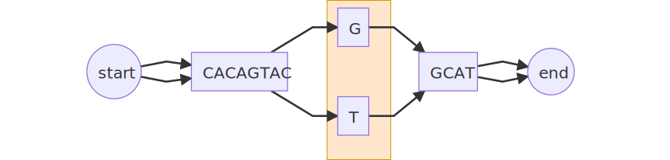

We have reduced $Work(14\times 14)=196$ 
to $Work(1 \times 1)=1$ 

## **196x** less “work”.

# De Bruijn **multiple** sequence alignment

Consider aligning 4 sequences

  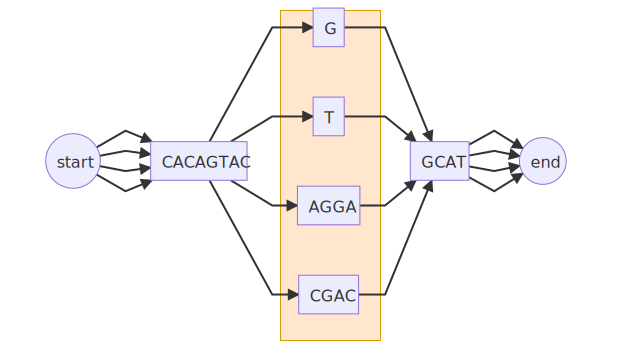

We have reduced $Work(13\times 13+13\times 16+16\times 16)=633$ for a progressive alignment
to $Work(1\times 1+1\times 4+4\times 5) = 24$ 

## **26x** less “work” than a progressive alignment

<!-- 
It is interesting that the more sequences you add, the greater the potential advantage of using a de Bruijn graph
-->

# Taking the de Bruijn graph to the next level

<br/>
<br/>

## We have changed the length of fragments 
<br/>
<br/>

## Can we change the **number** of fragments to align?

# RESULT: Reducing the **number** of fragments to be aligned

Consider this partial order graph containing 4 sequences
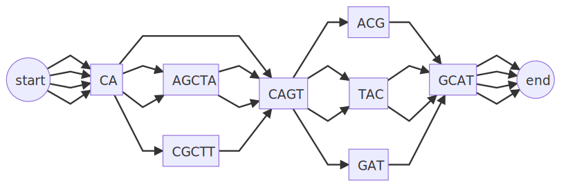

# RESULT: Reducing the **number** of fragments to be aligned
<!-- _paginate: hold -->

Consider this partial order graph containing 4 sequences
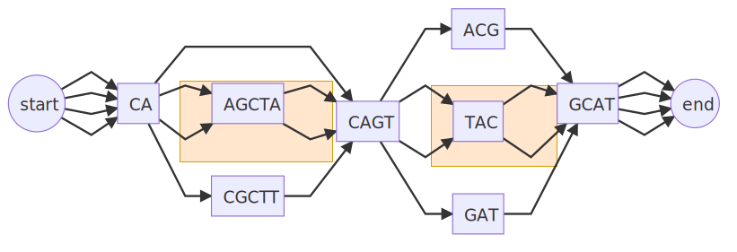

Sequences in bubbles can **braid** together

# RESULT: Reducing the **number** of fragments to be aligned
<!-- _paginate: hold -->
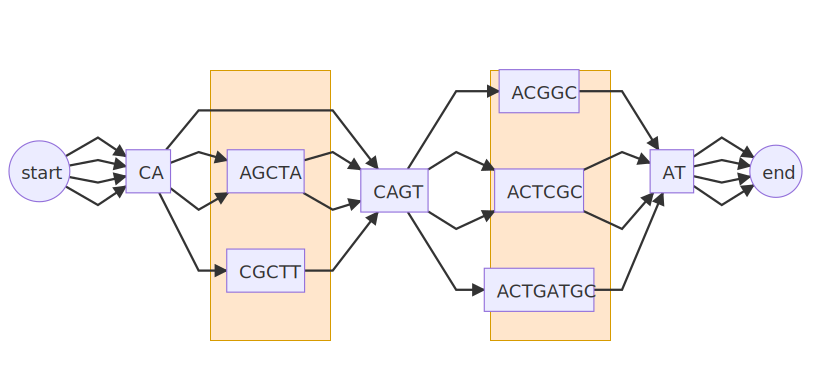

| progressive alignment | reduce length | reduce number |
|---|---|---|
$(14\times 18)+2(18\times 18)$ | $3(5^2) + 3(3^2)$ | $5^2 + 2(3^2)$ |
900 | 102 (**>8x** less work) | 43 (**>20x** less work)|

# RESULT: Reduce the dependence on the phylogeny

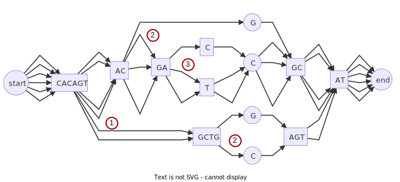

1. order fragments by depth of bubble
2. start with deepest set of fragments
3. align progressively


Align without needing to know in advance the phylogeny

# RESULT: Reduce the dependence on the phylogeny
<!-- _paginate: hold -->

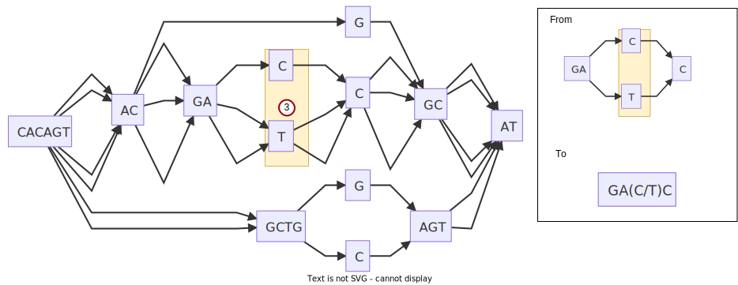

# RESULT: Reduce the dependence on the phylogeny
<!-- _paginate: hold -->


# RESULT: Reduce the dependence on the phylogeny
<!-- _paginate: hold -->

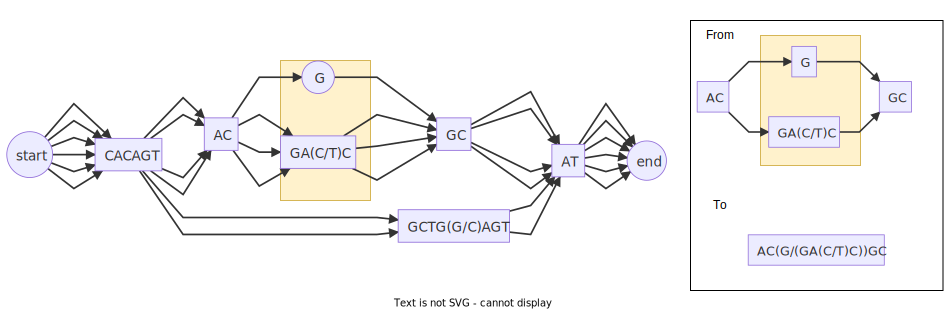

# RESULT: Reduce the dependence on the phylogeny
<!-- _paginate: hold -->

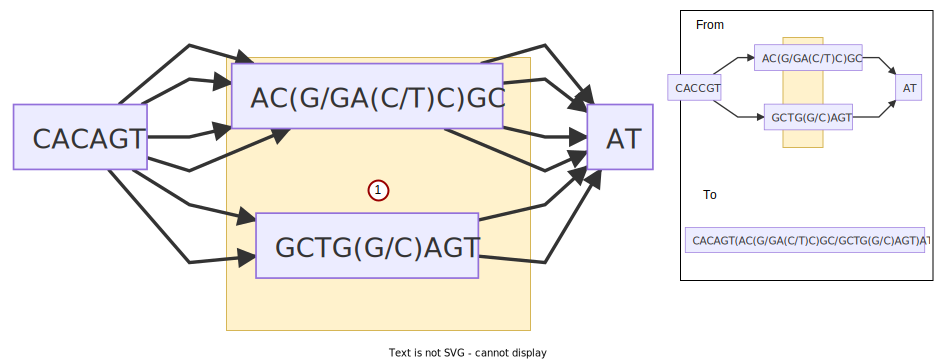

# RESULT: Reduce the dependence on the phylogeny
<!-- _paginate: hold -->

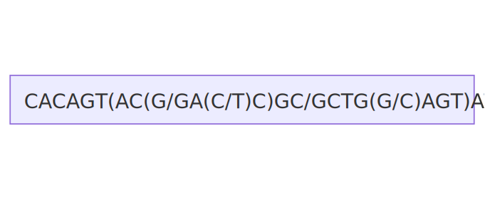

## Alignment completed without requiring a phylogeny


# RESULT: Work statistic from partial order graphs

Consider the following partial order graph containing a bubble within a bubble

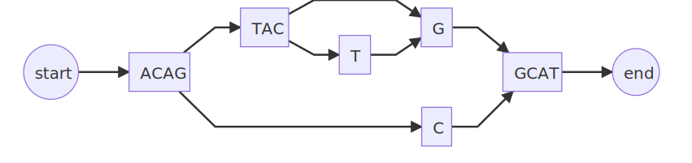

- Work statistic calculates the order of alignment work required (measured in comparisons) using 4 strategies
  - Exact = $13\times12\times9$  = **1404**
  - Progressive = $12\times13+13\times9$  = **273**
  - DBG_L = $4\times5+5\times1$ = **25** (simplification of sequence length)
  - DBG_LN =  $0\times1+5\times1$ = **5** (simplification of sequence length and count)

<!--  
Note: Gives the expected alignment work required, without actually aligning the sequences.  
So the work statistic can be used to rapidly quantify expected performance on a broad distribution of sequence classes 
-->

# Summary

It's quite clear that this method of using de Bruijn graphs to **reduce both length and number** of fragments to align in these synthetic examples offers a significant performance improvement over reducing just the length, and further significant improvements over the state of the art; progressive alignment.

de Bruijn graphs appear to break the 40 year tautology at the heart of **sequence alignment**, and **phylogenetic reconstruction**.

It is worth perservering with this method to see if it can be applied to evolved sequences.

 
### It looks like this method will make some very big questions tractable

# Future directions

- From first principals, in sequences evolved in an order consistent with data from a progressive tree, **to show that the bubbles in the graph correspond to nodes in a tree** and are similarly ordered
- Using data with known topologies and unambiguous evolution
  - show that the algorithm has **statistical performance** consistent with progressive alignment
  - show that the algorithm has **superior computational performance wrt time and memory** to progressive alignment
- Investigate sequences in species subject to **lateral gene flow** which progressive alignment struggles with

# Thanks

<div class="two_columns">
  <div>

- Gavin Huttley
- Vijini Mallawaarachchi
- Yu Lin
- Xinjian Leng

</div>
<div>

## ... and the Huttleylab


</div>

# Questions & Answers
<!-- paginate: skip-->

- [AIMS](#project-aims)          
- [BACKGROUND: Sequence alignment](#background-sequence-alignment)
- [CASES](#3-instructive-cases-of-sequence-alignment)
- [PROBLEM](#problem-sequence-alignment-is-a-big-job)
- [STATE OF THE ART](#state-of-the-art-progressive-alignment)
- [Alignment using De Bruijn Graphs](#sequence-alignment-using-de-bruijn-graphs)
- [Reduce **length** of fragments](#reducing-the-length-of-fragments-to-be-aligned)
- [RESULTS](#result-reducing-the-number-of-fragments-to-be-aligned)
  - [Reduce **number** of fragments](#result-reducing-the-number-of-fragments-to-be-aligned)
  - [Break **phylogeny** dependence](#result-reduce-the-dependence-on-the-phylogeny)
  - [work **statistics**](#result-work-statistic-from-partial-order-graphs)
- [SUMMARY](#summary)
- [FUTURE DIRECTIONS](#future-directions)
- [SUPPLEMENTARY](#supplementary)

[1](#project-aims) [2](#background-sequence-alignment) [3](#3-instructive-cases-of-sequence-alignment) [4](#case-evolution-of-rubisco) [5](#case-trajectory-of-the-spike-protein-of-sars-cov-2) [6](#case-our-immediate-family-tree)[7](#problem-sequence-alignment-is-a-big-job) [8](#problem-exhaustive-sequence-alignment-takes-time) [9](#reframe-work-increases-as-data-grows) [10](#problem-the-scale-of-our-3-cases) [11](#state-of-the-art-progressive-alignment) [12](#progressive-multiple-sequence-alignment) [13](#the-problem-space) [14](#what-if-we-could-quickly-remove-similar-regions) [15](#sequence-alignment-using-de-bruijn-graphs) [16](#de-bruijn-graphs) [17](#reducing-the-length-of-fragments-to-be-aligned)
[18](#de-bruijn-multiple-sequence-alignment) [19](#taking-the-de-bruijn-graph-to-the-next-level) [20](#result-reducing-the-number-of-fragments-to-be-aligned) [21](#result-reduce-the-dependence-on-the-phylogeny) [22](#result-work-statistic-from-partial-order-graphs) [23](#summary) [24](#future-directions) [25](#thanks)


# Citations

- Leng, Xingjian (2023), ‘Sequence Alignment Using De Bruijn Graphs’. Australian National University

- [Needleman & Wunsch (1970), 'A general method applicable to the search for similarities in the amino acid sequence of two proteins'  doi.org/10.1016/0022-2836(70)90057-4, 2010](https://doi.org/10.1016/0022-2836(70)90057-4)

- [Whitney, Houtz, and Alonso (2010), ‘Advancing Our Understanding and Capacity to Engineer Nature’s CO2-Sequestering Enzyme, Rubisco’ DOI: 10.1104/pp.110.164814](https://pubmed.ncbi.nlm.nih.gov/20974895/)


# Supplementary
<!-- paginate: skip -->

<div class="two_columns">
<div>
<blockquote>
<p>Abandon all hope ye who pass this point</p>

<cite>Tolkein ... probably</cite>
</blockquote>
</div>
<div>

- [de Bruijn graph alignment](#de-bruijn-graph-alignment)
- [sample data sources](#sample-data-sources)
- [Bubbles in real data denote phylogenetic nodes](#bubbles-in-real-data-denote-phylogenetic-nodes)
- unit tests against edge case sequence alignments
  - long sequences
  - numerous sequences
  - [cyclic sequences](#cyclic-sequences)
  - bubbles within bubbles
  - sequential bubbles


</div>

# de Bruijn graph alignment

- Construct a de Bruijn graph from sequences
- Project de Bruijn graph to a partial order graph
- Emit fragments from the partial order graph
- Align fragments 
- Reconstitute original sequences with the aligned fragments


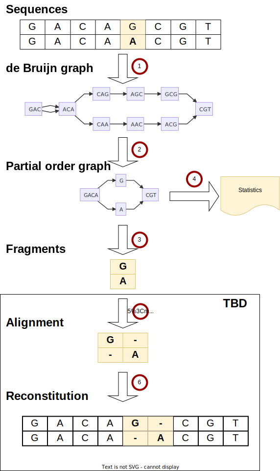

# Bubbles in real data denote phylogenetic nodes
<!-- paginate: skip -->
[<<Back to Supplementary](#supplementary)

We can show in a simple case this is true, but we need to show it is true in general

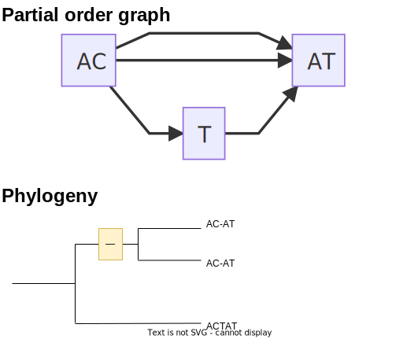

### HYPOTHESIS: One side of a bubble is a clade

# Unit tests
<!-- paginate: skip -->
[<<Back to Supplementary](#supplementary)

library against edge case sequence alignments
      * long sequences
      * numerous sequences
      * [cyclic sequences](#cyclic-sequences)
      * bubbles within bubbles
      * sequential bubbles

# cyclic sequences

```python
def test_pog_cycle(output_dir: Path):
    dbg = dbg_align.DeBrujinGraph(3,cogent3.DNA)
    dbg.add_sequence({
        "seq1": "ACAGTACGGCAT", 
        "seq2": "ACAGTACTGGCAT", 
        "seq3":"ACAGCGCGCAT" # contains cycle
        })
    with open(output_dir / "cycle.md", "w") as f:
        f.write("```mermaid\n")
        f.write(dbg.to_mermaid())
        f.write("```")   
    assert dbg.has_cycles()
    assert len(dbg) == 3
    assert dbg.names() == ["seq1", "seq2", "seq3"]
    assert dbg["seq3"] == "ACAGCGCGCAT" # contains cycle
     
    dbg.to_pog()
    # write mermaid out to testout folder
    with open(output_dir / "cycle_compressed.md", "w") as f:
        f.write("```mermaid\n")
        f.write(dbg.to_mermaid())
        f.write("```")
```
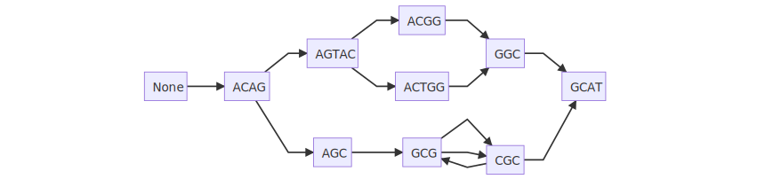
# Sample data sources

- BRCA1_divergent: BRCA1 gene divergent sample of 7 chosen from among 56 mammal species
- BRCA1_hominae:  BRCA1 gene from 4 hominae 
- SARS-CoV-2: 22 SARS-CoV-2 genomes
- IBD_phage: IBD phage components (https://doi.org/10.1016/j.cell.2015.01.002) |
- Ocean_phage: Tara oceans phage components (https://doi.org/10.1126/science.