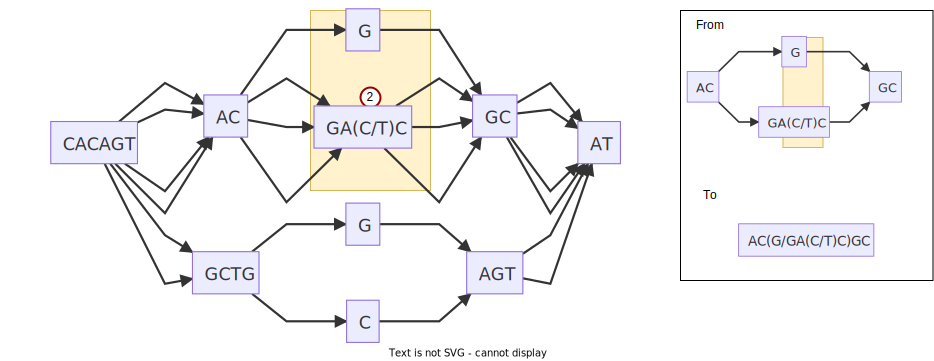
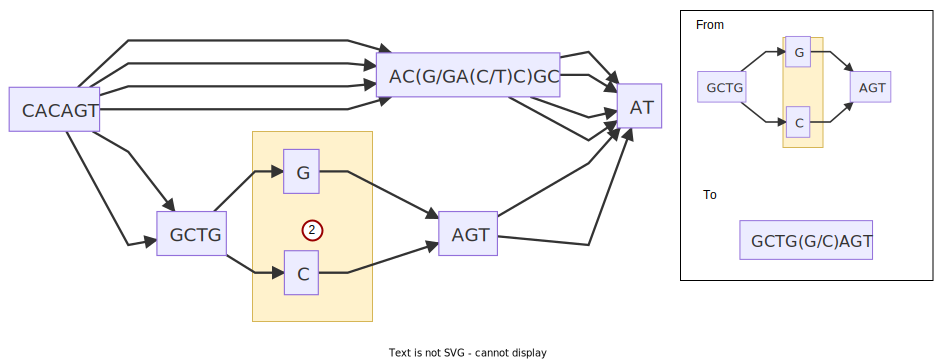

## BIOL8706: Dividing and conquering sequence alignment using De Bruijn Graphs
<!-- paginate: skip -->
<!-- _class: coverpage -->


- Student: Richard Morris
- Huttley lab, Australian National University
- Supervisors: Gavin Huttley, Vijini Mallawaarachchi 

# Sequence alignment
<!-- paginate: true -->
<!-- header: _Dividing and conquering sequence alignment using De Bruijn Graphs_ -->


# Sequence alignment
<!-- paginate: hold -->


#### We start with a set of DNA sequences (Note all different lengths)

# Sequence alignment


#### We align those sequences

# Sequence alignment


#### By lining up regions that are similar

# Sequence alignment


#### Noting those that are different

# Sequence alignment


#### And we can infer evolutionary relationships between those sequences 
- ingroup (1 letter different)
- outgroup (3 letters different)


# Sequence alignment
<!-- paginate: hold -->


#### And we can infer evolutionary relationships between those sequences 
- ingroup (1 letter different)
- outgroup (3 letters different)
- extinct common ancestor sequence 
- how long ago sequences diverged

# The central dogma of biology
<!-- paginate: true -->

$$
\text{DNA} \xrightarrow{\text{transcribe}} \text{RNA} \xrightarrow{\text{translate}} \text{Protein}
$$
If we can align homologous genes, we can infer homologous proteins


Sequence alignment is a **time machine** for homologous proteins

# 3 big ideas that require sequence alignment
- ## design crops for better yield
- ## predict the trajectory of a virus
- ## understand our own evolution


# Consider RuBisCO
<style>section { justify-content: flex-start; }</style>


- The most abundant protein on Earth 
- essential component of photosynthesis
- primary role is to convert CO₂ to organic carbon

<!-- _footer: "[Parry et al 2012 doi.org/10.1093/jxb/ers336](https://doi.org/10.1093/jxb/ers336) "-->

# Consider RuBisCO
<!-- _paginate: hold -->


- The most abundant protein on Earth 
- essential component of photosynthesis
- primary role is to convert CO₂ to organic carbon
</br>
<!-- _footer: "[Parry et al 2012 doi.org/10.1093/jxb/ers336](https://doi.org/10.1093/jxb/ers336) "-->

# Consider RuBisCO
<!-- _paginate: hold -->


- The most abundant protein on Earth 
- essential component of photosynthesis
- primary role is to convert CO₂ to organic carbon
</br>
<!-- _footer: "[Parry et al 2012 doi.org/10.1093/jxb/ers336](https://doi.org/10.1093/jxb/ers336) "-->

# Evolution of RuBisCO


- Sequence alignment can infer the evolutionary history of RuBisCO
- when novel features appeared
- And compare that with a geological understanding of the atmosphere at that time
<br>

ie: We can associate **features** in the protein with the **environment** in which it evolved?

<!-- _footer: "[Whitney et al 2012 doi.org/10.1104/pp.110.164814](https://doi.org/10.1104/pp.110.164814) "-->

<!-- This will tell us important things like RuBisCO innovations for different partial pressures of O₂ and CO₂-->
# The value of understanding RuBisCO's features?

Q: Can we design more efficient RuBisCO?

$\Uparrow$ RuBisCO efficiency would lead to
- Crop yield $\Uparrow$
- Carbon sequestration $\Uparrow$

<br>

#### This is a big question that sequence alignment can contribute to answering
<!-- 
RuBisCO processes ~3-10 CO₂ molecules per second
Contrast with ATP Synthase which generates 100-200 molecules of ATP per second
Can we engineer organisms that spend less time making RuBisCO, and more into extracting CO₂ from the atmosphere and making **carbohydrates** or **hydrocarbons**

-->

# Consider the spike protein of SARS-CoV-2

<div class="two_columns">
  <div>

Sequence alignment 
- allows us to identify conserved regions for vaccine/drug development
- can help us predict the virus's trajectory

#### These are big questions that sequence alignment can contribute to answering

  </div>
  <div>
    
    <span>Alignment of S mutation points of SARS-CoV-2 variants</span>
  </div>

# Consider our immediate family
<div class="two_columns">
  <div>

- What can we learn about our own evolution from our closest relatives?
- Can that knowledge inform biomedical science

#### This is a big question that sequence alignment can contribute to answering

  </div>
  <div>
    <figure>
      
      <figcaption>The family tree of great apes</figcaption>
    </figure>
  </div>
</div>

# Sequence alignment is a big job

- Historically sequence alignment was done manually, like a really big evil jigsaw puzzle
- Since 1972 it's become a computational problem
- The task is to compare **each** letter in **each** sequence with **all** the letters of **every** other sequence.

<br> 

- The terms: **each**, **all** and **every** should tell you that it will be a big job for computers too.


# Exhaustive sequence alignment takes time

A computational scientist might say that the asymptotic complexity of an exhaustive alignment is given by the big-O notation

## $O(L_1 \times L_2 \times \dots L_n)$ or $O(L^n)$

Where: 
- $L$ is the average length of the sequence
- $n$ is the number of sequences

<div><div class="quote">

<p>“Big-O tells you how code <strong>slows</strong> as data <strong>grows</strong>”</p>
<cite>Ned Batchelder</cite>
</div></div>

<!-- _footer: "[nedbatchelder.com](https://nedbatchelder.com/blog/201310/big_o_log_n.html)"-->

# Too much math?

Let's rephrase this big-O notation as the order of $Work(L^n)$

<hr/>

So we can reframe this as $Work$ **slows** as data **grows**

| Sequence length | **number of sequences** | $Work$ required (comparisons)|
|---|---|---|
| 1,000 | 2 | 1 Million |
| 1,000 | 3 | 1 Billion |
| 1,000 | 4 | 1 Trillion |
| 1,000 | 5 | 1 Quadrillion |

# Too much math?
<!-- _paginate: hold -->

Let's rephrase this big-O notation as the order of $Work(L^n)$

<hr/>

So we can reframe this as $Work$ **slows** as data **grows**

| **Sequence length** | number of sequences | $Work$ required (comparisons)|
|---|---|---|
| 1,000 | 3 | 1 Billion |
| 2,000 | 3 | 8 Billion |
| 3,000 | 3 | 27 Billion |
| 4,000 | 3 | 64 Billion |

# The scale of our 3 big problems

| Genomes | Length (bp) | Number | $Work$ required |
|---|---|---|---|
| RuBisCO producers | 1.5-500 mbp|350K$_1$| $\text{millions}^\text{hundreds\ of\ thousands}$|
| SARS-CoV-2 | ~29 kbp | >5M$_2$ | $\text{29 thousand}^\text{5 million}$|
| Great apes | ~30mbp | 5 | $\text{30 million}^5$ |

</br>

$^1$ back of the napkin math = 300K species of **plants** + 10's of thousands of species of **algae** + thousands of species of **cyanobacter**
$^2$ 5.1M in GISAID and other public repositories as of Oct 2021 - [www.nature.com/articles/s41588-022-01033-y](https://www.nature.com/articles/s41588-022-01033-y)
<!-- 
Note: The genes that produce the 2 subunits of RuBisCO are ~1500 and ~500 bp respectively
but the genomes of species that can make RuBisCO can be 1.5 - 500 mbp long 
we need to align the entire sequence to find where RuBisCO is being passed down the lineage
-->

# 


<!-- _footer: "Created with the Imgflip Meme Generator"-->
# <!--fit-->Progressive alignment

Progressive alignment is a strategy that reduces the work required


# <!--fit-->Progressive alignment
<!-- _paginate: hold -->

Progressive alignment is a strategy that reduces the work required

**Strategy**:
- align the 2 most closely related sequences into a statistical model called a profile


# <!--fit-->Progressive alignment
<!-- _paginate: hold -->

Progressive alignment is a strategy that reduces the work required

**Strategy**:
- align the 2 most closely related sequences into a statistical model called a profile
- align that profile with the next most closely related sequence 


# <!--fit-->Progressive alignment
<!-- _paginate: hold -->

Progressive alignment is a strategy that reduces the work required

**Strategy**:
- align the 2 most closely related sequences into a statistical model called a profile
- align that profile with the next most closely related sequence 
- Do that ${n\choose{2}}$ times


<!-- _paginate: hold -->

# <!--fit-->Progressive alignment

Progressive alignment is a strategy that reduces the work required

**Strategy**:
- align the 2 most closely related sequences into a statistical model called a profile
- align that profile with the next most closely related sequence 
- Do that ${n\choose{2}}$ times
<br/>

This reduces the order of $Work(L^n)$ $\rightarrow$ $Work(n^2.L^2)$ 
... which is a lot less $Work$ 


<!-- $Work$ grows just logarithmically with the number of sequences, rather than exponentially-->

# Progressive multiple sequence alignment (MSA)
<br/>
<br/>
<br/>

- ## To align multiple sequences first reconstruct a phylogeny to order by distance
- ## To reconstruct a phylogeny first align all sequences 

# Progressive multiple sequence alignment (MSA)
<!-- _paginate: hold -->

<br/>
<br/>
<br/>

- ## To align multiple sequences first reconstruct a phylogeny to order by distance
- ## To reconstruct a phylogeny first align all sequences 

<br/>
<br/>
<br/>

## Do you see the problem?

# 


<!-- _footer: "Created with the Imgflip Meme Generator"-->

# The problem space

Sequence alignment is sensitive to 
- The **length** of sequences to be aligned
- The **number** of sequences to be aligned
- the “ Chicken and Egg ” problem

</hr>

An ideal strategy would reduce 
- The **length** of sequences to be aligned
- The **number** of sequences to be aligned
- Dependence on knowing the phylogeny in advance

# What if we could **quickly** remove similar regions?


<br/>
<br/>
<br/>

### We'd could focus resources on just the regions that differ

# Sequence alignment using De Bruijn Graphs

My work builds upon the work by Xingjian Leng in 2022, under the supervision of Dr. Yu Lin and Prof. Gavin Huttley. 

Xingjian tackled the length problem using de Bruijn graphs 


You might have heard of de Bruijn graphs for sequence assembly from reads.  

De Bruijn graphs can also be used for sequence alignment.

# De Bruijn graphs

A De Bruijn graph is a directed graph that represents unique overlapping subsequences 

Building a De Bruijn graph is $Work(nL)$ 

#### This “Work” scales linearly not exponentially.

Consider the following sequence as a de Bruijn graph of order 3 (nodes overlap by 2 characters):


# De Bruijn graphs
<!-- _paginate: hold -->
A De Bruijn graph is a directed graph that represents unique overlapping subsequences

Building a De Bruijn graph is $Work(nL)$ 

#### This “Work” scales linearly not exponentially.

Consider the following sequence as a de Bruijn graph of order 3 (nodes overlap by 2 characters):


# De Bruijn graphs
<!-- _paginate: hold -->
A De Bruijn graph is a directed graph that represents unique overlapping subsequences

Building a De Bruijn graph is $Work(nL)$ 

#### This “Work” scales linearly not exponentially.

Consider the following sequence as a de Bruijn graph of order 3 (nodes overlap by 2 characters):


# De Bruijn graphs
<!-- _paginate: hold -->
A De Bruijn graph is a directed graph that represents unique overlapping subsequences

Building a De Bruijn graph is $Work(nL)$ 

#### This “Work” scales linearly not exponentially.

Consider the following sequence as a de Bruijn graph of order 3 (nodes overlap by 2 characters):


And we keep going until we have created the graph

# Reducing the **length** of sequence to be aligned

Sequence A: `CACAGTACGGCAT` 


Sequence B: `CACAGTACTGCAT` 


These differ in just one nucleotide in the middle of the sequence

If we combine both sequences into a single de Bruijn graph, it will develop **“bubbles”** where regions are different.

# Reducing the **length** of sequence to be aligned
<!-- _paginate: hold -->

Sequence A: `CACAGTACGGCAT` 


Sequence B: `CACAGTACTGCAT` 


These differ in just one nucleotide in the middle of the sequence

If we combine both sequences into a single de Bruijn graph, it will develop **“bubbles”** where regions are different.


# Reducing the **length** of sequence to be aligned
<!-- _paginate: hold -->

If we transform the graph into a partial order graph, we can see the regions that are similar which we don't need to align, and the regions that are different (in the gold box) which we do.


Now we can use a traditional algorithm to align the regions $\boxed{G}$ and $\boxed{T}$, and we've reduced $Work(14\times 14)$ down to $Work(1 \times 1)$ = **196x** less “work”.

# De Bruijn multiple sequence alignment

And we can extend this trivially to multiple sequences.  Consider aligning 4 sequences

<br>
<div class="two_columns" >
  <div>

  

  </div>
  <div class = "bottom_align_contents">
    <div>
      <p>Now we've reduced Work(13x13x16x16) down to Work(1x1x5x4)</p>
      <p> = <strong>2,163x</strong> less “work”</p>
    </div>
  </div>
</div>
<!-- 
Interesting how the more sequences you add, the greater the potential advantage of using a de Bruijn graph
-->

# Taking the de Bruijn graph to the next level

- recall exact alignment has a Work order of $Work(L^n)$ or $Work(L_1 \times L_2 \times \dots \times L_n)$ 
- if we reduce the length of the sequences we need to align then we reduce L

# Taking the de Bruijn graph to the next level
<!-- _paginate: hold -->

- recall exact alignment has a Work order of $Work(L^n)$ or $Work(L_1 \times L_2 \times \dots \times L_n)$ 
- if we reduce the length of the sequences we need to align then we reduce L

<br/>
<br/>

## Can we change the **number** of sequences to align?

# Reducing the **number** of sequences to be aligned

Consider this partial order graph containing 4 sequences with overlaps removed


# Reducing the **number** of sequences to be aligned
<!-- _paginate: hold -->

Consider this partial order graph containing 4 sequences


| exhaustive alignment | reduce length | reduce length & number |
|---|---|---|
|$Work(13\times 14\times 17 \times17 )$ | $Work(5^4 + 3\times 2 \times 2 \times 3)$ | $Work(5^2 + 3\times 2 \times 3)$ |
| 52,598 | 661 (**79x** vs exhaustive) | 43 (**1223x**  vs exhaustive)|

# Reduce the dependence on the phylogeny


By ordering progressive alignment by descending “bubble” depth, we can progressively align without needing to know in advance the phylogenetic relation between sequences.

# Reduce the dependence on the phylogeny
<!-- _paginate: hold -->


# Reduce the dependence on the phylogeny
<!-- _paginate: hold -->



# Reduce the dependence on the phylogeny
<!-- _paginate: hold -->



# Reduce the dependence on the phylogeny
<!-- _paginate: hold -->


# Reduce the dependence on the phylogeny
<!-- _paginate: hold -->


## Alignment completed without requiring a phylogenetic guide tree

# Project aims

* Investigate De Bruijn graphs for multi-sequence alignment (MSA)
* Build a python library to
    * Resolve the De Bruijn graph to a partial order graph of segments to align
    * identify “bubbles”
    * Develop unit tests to verify correctness 
* Develop statistics for de Bruijn graphs to predict efficiency

# Results: Work statistic

Consider the same order 3 de Bruijn graph 


- Work calculates the order of alignment work using 4 strategies
  - Exact = $13\times12\times9 = 1404$
  - Progressive = $13\times12+13\times9 = 285$
  - DBG_L = $4\times5+5\times1 = 25$ (simplification of sequence length)
  - DBG_LN =  $0\times1+5\times1 =5$ (simplification of sequence length and count)

# Results: Quickwork statistic

Consider this order 3 de Bruijn graph containing 3 sequences [`ACAGTACGGCAT`, `ACAGTACTGGCAT`, `ACAGCGCAT`] of length 12, 13 and 9
When transformed into a partial order graph 


Contains the following nodes (left to right) with ACAG and GCAT (already aligned sections) removed TAC+T+G+C 

Quickwork = $\sum\text{non aligned node length }$ = $6$
Quickwork has an order of $Work(node\_count)$ 

  <!-- 
  Why is DBG_LN() different from Quickwork()
  Quickwork() does not take into account how the distribution of differences affects the work or how zero length edges affect the work
   -->

# Results: Calculated order complexity 

## Sample Sequence sets

| Genomes | Average Length (bp) | Number | Description |
|---|---|---|---|
| BRCA1_divergent | ~3k | 56 | BRCA1 gene divergent sample of 7 chosen from among 56 mammal species |
| BRCA1_hominae | ~3k | 4 | BRCA1 gene from 4 hominae |
| SARS-CoV-2 | 30k | 22 | SARS-CoV-2 genomes (citation needed) |
| IBD_phage | 40k | 60 | IBD phage components (https://doi.org/10.1016/j.cell.2015.01.002) |
| Ocean_phage | 40k | 130 | Tara oceans phage components (https://doi.org/10.1126/science.1261605) |

| Work metric | Description | 
|---|---|
| Exact | Exhaustive alignment 
| Progressive | Progressive alignment
| dBG(3)_L | De Bruijn graph of order 3 with length simplification 
| dBG(3)_LN | De Bruijn graph of order 3 with length and number simplification
| dBG($k$)_LN | De Bruijn graph of order $k$ with length and number simplification


# Results: Calculated order of Work

| Genomes | Exact | Progressive | dBG(3)_L | dBG(3)_LN | dBG(4)_LN | dBG(5)_LN | dBG(6)_LN | dBG(7)_LN |dBG(8)_LN |dBG(9)_LN |
|---|---|---|---|---|---|---|---|---|---|---|
| BRCA1_divergent |  |  |  |  |
| BRCA1_hominae |  |  |  |  |
| SARS-CoV-2 |  |  |  |  |
| IBD_phage |  |  |  |  |
| Ocean_phage |  |  |  |  |

# Results: Quickwork 

| Genomes | dBG(3) | dBG(4) | dBG(5) | dBG(6) | dBG(7) | dBG(8) | dBG(9) | 
|---|---|---|---|---|---|---|---|
| BRCA1_divergent |  |  |  |  |
| BRCA1_hominae |  |  |  |  |
| SARS-CoV-2 |  |  |  |  |
| IBD_phage |  |  |  |  |
| Ocean_phage |  |  |  |  |

# Sample unit tests: cyclic sequences

```python
def test_pog_cycle(output_dir: Path):
    dbg = dbg_align.DeBrujinGraph(3,cogent3.DNA)
    dbg.add_sequence({
        "seq1": "ACAGTACGGCAT", 
        "seq2": "ACAGTACTGGCAT", 
        "seq3":"ACAGCGCGCAT" # contains cycle
        })
    with open(output_dir / "cycle.md", "w") as f:
        f.write("```mermaid\n")
        f.write(dbg.to_mermaid())
        f.write("```")   
    assert dbg.has_cycles()
    assert len(dbg) == 3
    assert dbg.names() == ["seq1", "seq2", "seq3"]
    assert dbg["seq3"] == "ACAGCGCGCAT" # contains cycle
     
    dbg.to_pog()
    # write mermaid out to testout folder
    with open(output_dir / "cycle_compressed.md", "w") as f:
        f.write("```mermaid\n")
        f.write(dbg.to_mermaid())
        f.write("```")
```

# Discussion

de Bruijn graphs offer an interesting method to 
- Reduce the impact of both sequence length and sequence number over traditional alignment approaches 
- Break the tautology at the heart of both Sequence alignment, and Phylogenetic reconstruction

### This method may make some very big questions tractable

# Future directions

Investigate the potential of using de Bruijn Graphs to;

- Identify reverse complimented regions from a dBG
- Identify genetic distance and infer phylogeny from a dBG
- Process sequences in databases storing dBG structures back to the database, reducing active memory limits for large numbers of large sequences
- Investigate advantage wrt species subject to lateral gene flow 
  - eg: Bacteria, Archaea
  - identifying multi-rooted phylogenies 
- Investigate using dBG's for targeted sequence extraction using pattern recognition templates
- Identify strategies for chosing the ideal kmer length for a given set of sequences

# Thanks

<div class="two_columns">
  <div>

- Gavin Huttley
- Yu Lin
- Vijini Mallawaarachchi
- Xinjian Leng
</div>
<div>

## ... and the Huttleylab


</div>

# Thanks
<!-- paginate: skip-->

<div class="two_columns">
  <div>

- Gavin Huttley
- Yu Lin
- Vijini Mallawaarachchi
- Xinjian Leng

<br/>
<br/>
<br/>
<br/>

## Q&A


</div>
<div>


## ... and the Huttleylab


</div>


# Errata
<!-- paginate: skip -->

<div class="two_columns">
<div>
<blockquote>
<p>Abandon all hope ye who pass this point</p>

<cite>Tolkein ... probably</cite>
</blockquote>
</div>
<div>

- [Sequence alignment order complexity](#sequence-alignment-order-complexity)
- [Pairwise sequence alignment methods](#pairwise-sequence-alignment-methods)
- [Multiple sequence alignment strategies](#multiple-sequence-alignment-mas-strategies)
- [unit tests](#unit-tests)


</div>

# Sequence alignment order complexity
<!-- paginate: skip -->
[<<Back to Errata](#errata)
## Pairwise sequence alignment
- Compare every letter in one sequence to every letter in the other
- order complexity of $O(mn)$ 
  - where **m** and **n** are lengths of the sequences
## Multiple sequence alignment (MSA)
- Perform a pairwise alignment of every sequence to every other sequence
- order complexity of $O(L^n)$ 
  - where **L** is the length of the sequences 
  - **n** is the number of sequences

<!-- The pairwise algorithms are both actually O(mn) where m and n are the lengths of the 2 sequences. -->

# Pairwise sequence alignment methods: $O(mn)$
<!-- paginate: skip -->
[<<Back to Errata](#errata)
<div class="two_columns">
  <div>

- Needlemann-Wunsch algorithm: global alignment for highly similar sequences
    - scoring system that penalises gaps and mismatches
- Smith-Waterman algorithm: better for local alignment to find conserved domains
    - allows for alignment to reset when the score falls to 0

  </div>
  <div>
Compare each nucleotide in one sequence to each nucleotide in the other sequence

Given a simple scoring system +1 match, -1 mismatch, -2 gap ($\delta$)

Where $F(i,j) = \max \text{of the following}$

$$
\begin{array}{l} 
⇖ F(i-1, j-1) + s(A_i, B_j), \quad \text{(match/mismatch)}\\
⇑ F(i-1, j) + \delta, \quad \text{(deletion)}\\
⇐F(i, j-1) + \delta, \quad \text{(insertion)}
\end{array}
$$

|  | gap  | A | G | C | A |  A |
|----|---|---|---|---|---|---|
|**gap**|**_0_**|⇐-2|⇐-4|⇐-6|⇐-8|⇐-10
| **A** |⇑-2| ⇖ **_1_** |⇐ **-1** |⇐-3 |⇐-5 |⇐⇖-7|
| **C** |⇑-4|⇑-1 |⇖0 |⇖ **_0_** |⇐-2 |⇐-4|
| **G** |⇑-6|⇑-3 |⇖0 |⇖-1 |⇖ **_1_** |⇐-1|
| **A** |⇑-8|⇖⇑-5 |⇑-2 |⇖-1 | ⇑-1|⇖ **_2_**|
| **A** |⇑-10|⇖⇑-7 |⇑-4 |⇖⇑-3 |⇖-2|⇖⇑ **_0_**|

backtrace from bottom right selecting the value that _**maximizes**_ the alignment score results in the following alignment 

|||||||
|---|---|---|---|---|---|
| sequence 1 | - | C | G | A | A |
| sequence 2 | G | C | G | A | - |

  </div>
</div>

# Multiple sequence alignment (MAS) strategies  
<!-- paginate: skip -->
[<<Back to Errata](#errata)

- Pairwise alignment of each possible pair
    - ${n\choose 2} \times O(L^2) = \frac{n(n-1)}{2} \times O(L^2) = O(n^2.L^2)$
- Progressive alignment eg: ClustalW
    - create a guide tree  
    - Progressively align pairs most closely related to profiles, and then align profiles 
- Iterative methods  eg: MUSCLE, T-Coffee, MAAFT
    - create an preliminary fast less accurate alignment 
    - iteratively improve alignment using some scoring function
    - Complete when some convergence criterion is met
- Hidden markov models $O(nL) + O(LM)$ (M is the number of states in the model)
    - eg: HMMER
    - create a statical model of the transition between states 
    - Determine likely alignment based on the model

# Unit tests
<!-- paginate: skip -->
[<<Back to Errata](#errata)

library against edge case sequence alignments
      * long sequences
      * numerous sequences
      * cyclic sequences
      * bubbles within bubbles
      * sequential bubbles