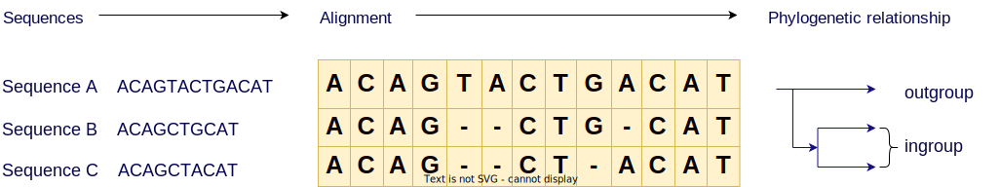
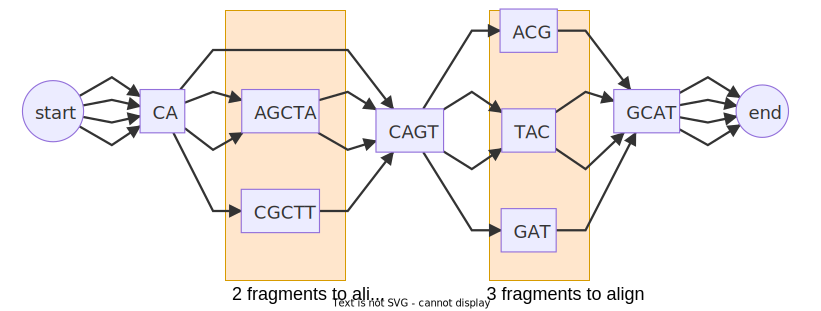

## BIOL8706: Dividing and conquering sequence alignment using De Bruijn Graphs
<!-- paginate: skip -->
<!-- _class: coverpage -->


- Student: Richard Morris
- Huttley lab, Australian National University
- Supervisors: Gavin Huttley, Vijini Mallawaarachchi 

# Sequence alignment
<!-- paginate: true -->
<!-- header: _Dividing and conquering sequence alignment using De Bruijn Graphs_ -->



**What?**: _arranges sequences of DNA, RNA or Protein to identify regions of similarity_
**Why?**: _Uncover evolutionary relationships between sequences_
**How?**: _comparing each letter in each sequence with every other letter_

<!-- 
Imagine being able to unravel the path of evolution of any protein 
to design better crops for yield
This is a case for sequence alignment
-->

# Consider Rubisco


- one of the most abundant proteins on Earth 

<!-- _footer: "[Parry et al 2012 doi.org/10.1093/jxb/ers336](https://doi.org/10.1093/jxb/ers336) "-->

# Consider Rubisco
<!-- _paginate: hold -->


- one of the most abundant proteins on Earth 
- **essential component of photosynthesis**
<!-- _footer: "[Parry et al 2012 doi.org/10.1093/jxb/ers336](https://doi.org/10.1093/jxb/ers336) "-->

# Consider Rubisco
<!-- _paginate: hold -->


- one of the most abundant proteins on Earth 
- essential component of photosynthesis
- **primary role is to convert CO₂ to organic carbon**

<!-- _footer: "[Parry et al 2012 doi.org/10.1093/jxb/ers336](https://doi.org/10.1093/jxb/ers336) "-->

# Evolution of Rubisco


- Genomic sequencing has identified 3 different clades of Rubisco, in 3 kingdoms of life
- Phylogenetic analysis suggests when **innovations** in Rubisco appeared 
- We can compare that to the Earths atmosphere at that time

<!-- _footer: "[Whitney et al 2012 doi.org/10.1104/pp.110.164814](https://doi.org/10.1104/pp.110.164814) "-->

<!-- This will tell us important things like Rubisco innovations for different partial pressures of O₂ and CO₂-->
# The value of understanding Rubisco innovations?

- Rubisco is very slow 
- Q: Can we design more efficient Rubisco?
- $\uparrow$ Rubisco efficiency would lead to
  - Food crop yield $\uparrow$
  - Carbon sequestration $\uparrow$
  - Biological hydrocarbon (eg: CH₄) production $\uparrow$

<!-- 
Rubisco processes ~3-10 CO₂ molecules per second
Contrast with ATP Synthase which generates 100-200 molecules of ATP per second
Can we engineer organisms that spend less time making Rubisco, and more into extracting CO₂ from the atmosphere and making **carbohydrates** or **hydrocarbons**

-->

# Consider the spike protein of SARS-CoV-2

<div class="two_columns">
  <div>

#### Alignment of eg: a viral genome allows us to:
  * Identify conserved regions for vaccine/drug development
  * Identify changes in function to make predictions about the virus' behaviour
  * Identify and prepare for emerging variants

  </div>
  <div>
    
    <span>Alignment of S mutation points of SARS-CoV-2 variants</span>
  </div>

# Consider our immediate family
<div class="two_columns">
  <div>

- How do we differ from our closest relatives?
- What was happening when our species diverged one from another?
- What can we learn about our own evolution from our closest relatives?
- How can that knowledge inform biomedical science

  </div>
  <div>
    <figure>
      
      <figcaption>The family tree of great apes</figcaption>
    </figure>
  </div>
</div>

# How we build a phylogeny from extant sequences


<br/>

- Sequence alignment is the first step in building a phylogeny
- Exhaustive alignment compares every character in each sequence with every character in every other sequence

# Exhaustive alignment takes time

A computational scientist might say that the asymptotic complexity of an exhaustive alignment is given by 

## $O(L^n)$ 

Where: 
- $L$ is the average length of the sequence
- $n$ is the number of sequences

<div><div class="quote">
<p>“ Big-O tells you how code slows as data grows ”</p>
<cite>Ned Batchelder</cite>
</div></div>

<!-- _footer: "[nedbatchelder.com](https://nedbatchelder.com/blog/201310/big_o_log_n.html)"-->

# 

Let's rephrase this big-O notation into a more biologically relevant concept of **“Work”**

<hr/>

So we can say that **“Work”** slows as data grows

| Sequence length | **number of sequences** | “Work” required (comparisons)|
|---|---|---|
| 1,000 | 2 | 1,000,000 |
| 1,000 | 3 | 1,000,000,000 |
| 1,000 | 4 | 1,000,000,000,000 |
| 1,000 | 5 | 1,000,000,000,000,000 |

# 
<!-- _paginate: hold -->

Let's rephrase this big-O notation into a more biologically relevant concept of **“Work”**

<hr/>

So we can say that **“Work”** slows as data grows

| **Sequence length** | number of sequences | “Work” required (comparisons)|
|---|---|---|
| 1,000 | 3 | 1,000,000,000 |
| 2,000 | 3 | 8,000,000,000 |
| 3,000 | 3 | 27,000,000,000 |
| 4,000 | 3 | 64,000,000,000 |

# The scale of our big questions

| Genomes | Length (bp) | Number | “Work” required |
|---|---|---|---|
| Species that make Rubisco | 1.5-500 mbp|>350,000| $\text{millions}^\text{hundreds\ of\ thosands}$|
| SARS-CoV-2 | ~29,903 | >5 million | $29,903^\text{5 million}$|
| Great ape evolution | ~30mbp | 5 | $\text{30 million}^5$ |

<!-- 
300k species of plants
10's of thousands of species of algae
thousands of species of cyanobacteria 

The 2 genes that produce the subunits of Rubisco are ~1500 and ~500 bp, but the genomes of species that can make Rubisco can be 1.5 - 500 mbp long and we need to align the entire sequence to find where rubisco is being passed down the lineage

-->

# 


<!-- _footer: "Created with the Imgflip Meme Generator"-->
# Computational complexity


# Progressive alignment

There is a way to improve 


# Why is MSA so computationally expensive?

- An exhaustive solution has an order complexity of $O(L^n)$ 
  - **L** is the length of the sequence 
  - **n** is the number of sequences
</hr>

# MSA for SARS-CoV-2 genomes?
<div class="two_columns">
  <div>

## SARS-CoV-2 
- length: **~29,903** bp
- number: **over 5 million** (as of March 2022) <sup>1</sup>
- $O(29,903^\text{over 5 million})$ is a **very large number**
##### **Required: a method to align large numbers of small sequences**

  </div>
  <div>
    <figure>
      
      <figcaption>Fig 1: Artists rendition of SARS-CoV-2</figcaption>
    </figure>
  </div>
</div>

<!-- _footer: "<sup>1</sup> [doi.org/10.1038/s41588-022-01033-y](doi.org/10.1038/s41588-022-01033-y) | Fig 1 [doi.org/10.7875/togopic.2020.199](doi.org/10.7875/togopic.2020.199)"-->


# Required: a more efficient method to align 
  - large numbers of small sequences
  - small numbers of very similar long sequences


# Sequence alignment order complexity

## Pairwise sequence alignment
- Compare every letter in one sequence to every letter in the other
- order complexity of $O(mn)$ 
  - where **m** and **n** are lengths of the sequences
## Multiple sequence alignment (MSA)
- Perform a pairwise alignment of every sequence to every other sequence
- order complexity of $O(L^n)$ 
  - where **L** is the length of the sequences 
  - **n** is the number of sequences

<!-- The pairwise algorithms are both actually O(mn) where m and n are the lengths of the 2 sequences. -->

# Pairwise sequence alignment methods: $O(mn)$
<div class="two_columns">
  <div>

- Needlemann-Wunsch algorithm: global alignment for highly similar sequences
    - scoring system that penalises gaps and mismatches
- Smith-Waterman algorithm: better for local alignment to find conserved domains
    - allows for alignment to reset when the score falls to 0

  </div>
  <div>
Compare each nucleotide in one sequence to each nucleotide in the other sequence

Given a simple scoring system +1 match, -1 mismatch, -2 gap ($\delta$)

Where $F(i,j) = \max \text{of the following}$

$$
\begin{array}{l} 
⇖ F(i-1, j-1) + s(A_i, B_j), \quad \text{(match/mismatch)}\\
⇑ F(i-1, j) + \delta, \quad \text{(deletion)}\\
⇐F(i, j-1) + \delta, \quad \text{(insertion)}
\end{array}
$$

|  | gap  | A | G | C | A |  A |
|----|---|---|---|---|---|---|
|**gap**|**_0_**|⇐-2|⇐-4|⇐-6|⇐-8|⇐-10
| **A** |⇑-2| ⇖ **_1_** |⇐ **-1** |⇐-3 |⇐-5 |⇐⇖-7|
| **C** |⇑-4|⇑-1 |⇖0 |⇖ **_0_** |⇐-2 |⇐-4|
| **G** |⇑-6|⇑-3 |⇖0 |⇖-1 |⇖ **_1_** |⇐-1|
| **A** |⇑-8|⇖⇑-5 |⇑-2 |⇖-1 | ⇑-1|⇖ **_2_**|
| **A** |⇑-10|⇖⇑-7 |⇑-4 |⇖⇑-3 |⇖-2|⇖⇑ **_0_**|

backtrace from bottom right selecting the value that _**maximizes**_ the alignment score results in the following alignment 

|||||||
|---|---|---|---|---|---|
| sequence 1 | - | C | G | A | A |
| sequence 2 | G | C | G | A | - |

  </div>
</div>

# Multiple sequence alignment (MAS) strategies  
- Pairwise alignment of each possible pair
    - ${n\choose 2} \times O(L^2) = \frac{n(n-1)}{2} \times O(L^2) = O(n^2.L^2)$
- Progressive alignment eg: ClustalW
    - create a guide tree  
    - Progressively align pairs most closely related to profiles, and then align profiles 
- Iterative methods  eg: MUSCLE, T-Coffee, MAAFT
    - create an preliminary fast less accurate alignment 
    - iteratively improve alignment using some scoring function
    - Complete when some convergence criterion is met
- Hidden markov models $O(nL) + O(LM)$ (M is the number of states in the model)
    - eg: HMMER
    - create a statical model of the transition between states 
    - Determine likely alignment based on the model

# The problem at the core of genetic alignment

<div class="two_columns">
  <div>
<br/>
<br/>

- ## Alignment needs trees
To align sequences accurately and efficiently, one should know the phylogenetic relationships among the sequences to better guide the alignment process
<br/>
<br/>

- ## Trees need alignment
to infer a phylogenetic tree accurately, one needs a well-aligned set of sequences
  </div>
  <div>


</div> 
<!-- _footer: "Created with the Imgflip Meme Generator"-->

# What if we could quickly remove regions that are similar?


### We'd be able to focus our computational resources on just the regions that are different.

# Sequence alignment using De Bruijn Graphs

This work builds on the work by Xingjian Leng in a 12 month undergraduate research project in 2022, under the supervision of Dr. Yu Lin and Prof. Gavin Huttley. 

That project focused on the alignment of closely related viral genomes, with a particular emphasis on SARS-CoV-2. The method is based on the construction and utilization of de Bruijn graphs for both pairwise and multiple sequence alignment tasks.

# De Bruijn graphs

A De Bruijn graph is a directed graph that represents unique overlapping subsequences (or k-mers) at the nodes.  This structure is an efficient way to identify sequence overlaps, and common regions.  

Building a De Bruijn graph has an order complexity of $O(nL)$ 


# Overlapping k-mers

Consider the DNA sequence $\boxed{CACAGTACGGCAT}$ when broken into 3 character overlapping subsequences (or 3-mers) looks like this:

$
\boxed{CAC}\quad\quad\quad\quad\quad\quad \boxed{ACG} \\
\quad \boxed{ACA}\quad\quad\quad\quad\quad\quad \boxed{CGG} \\
\quad\quad \boxed{CAG}\quad\quad\quad\quad\quad\quad \boxed{GGC} \\
\quad\quad\quad \boxed{AGT} \quad\quad\quad\quad\quad\quad \boxed{GCA}\\
\quad\quad\quad\quad \boxed{GTA}\quad\quad\quad\quad\quad\quad \boxed{CAT}\\
\quad\quad\quad\quad\quad \boxed{TAC}\\
$
# De Bruijn graphs

When we represent that as a de Bruijn graph it looks like this:


# A second sequence

Consider we want to align that sequence $\boxed{CACAGTAC\boxed{G}GCAT}$ to the very similar sequence $\boxed{CACAGTAC\boxed{T}CGCAT}$

Which as a De Bruijn graph looks like this:


# De Bruijn pairwise alignment

#### Sequence A: 
</hr>

#### Sequence B: 
</hr>

If we combine both sequences into a single de Bruijn graph, we can easily identify the regions that are similar and the regions that are different.


# Resolving the graph

We can collect nodes with 2 edge, or 1 edge into single nodes, and we can see the regions that are similar and the regions that are different.


Now we can use a traditional algorithm to align the regions $\boxed{AC\boxed{G}GC}$ and $\boxed{AC\boxed{T}GC}$, and we've reduced $O(14^2)$ down to $O(5^2)$ = **7.8x** less work.

# De Bruijn multiple sequence alignment

And we can extend this to multiple sequences.  Consider aligning the following sequences
`CACAGTACGGCAT` `CACAGTACTGCAT` `CACAGTACTGGAGCAT`& `CACAGTACTGATGCAT`

</hr>

<div class="two_columns">
  <div>

  

  </div>
  <div>
    Now we've reduced O(13x13x16x16) down to O(6x6x8x8) = <strong>18.8x</strong> less work
  </div>
</div>

# Reducing the horizontal complexity of the problem

- Horizontal component of the problem is the length (L) of the sequences to be aligned
- recall an exact alignment has an order complexity of $O(L^n)$
- if we reduce the length of the sequences we need to align we reduce L


#### **How about n?**

# Reducing the vertical complexity of the problem

- Vertical component of the problem is the number of sequences to be aligned (n)



- Any matches or deletions reduces the number of sequences we need to align

# Project aims

* Investigate the use of De Bruijn graphs to identify regions of dissimilarity for traditional alignment algorithms
* Build a python library for investigating De Bruijn Graph Multi-sequence alignment
    * Resolve the De Bruijn graph to a partial order graph to reduce horizontal complexity
    * Convert matched pairs of bubble edges to profiles to reduce vertical complexity
    * Develop unit tests that verify the correctness of the library against edge case sequence alignments
      * long sequences
      * numerous sequences
      * cyclic sequences
      * bubbles within bubbles
      * sequential bubbles
* Develop statistics for any set of sequences, for a range of possible kmer lengths
    * Time complexity 
      * how many alignment operations are required for exact, progressive, 1 dimensional de Bruin graphs, and 2 dimensional de Bruin graphs
    * Memory use ratio
      * how much memory is required to store the partial order graph over the amount present in the sequences
    * Compression ratio
      * how much information about common subsequences is retained in the partial order graph

# Results: projected memory use ratio

Memory complexity is the amount of actual memory required to stor a sequence divided by the amount of memory required for the original sequences


Converted into a partial order graph 


- Memory complexity = $30 / 34$


# Results: projected order complexity


Converted into a partial order graph 


- Exact alignment  = $13\times12\times9 = 1404$
- Progressive alignment = $13\times12+12\times9+13\times9 = 381$
- 1 dimensional de Brujin Graph simplification then progressive alignment = $9\times8+8\times5+9\times5 = 157$
- 2 dimensional de Brujin Graph simplification then progressive alignment =  $4\times5+5\times9+4\times9 =101$

# Results: Projected compression ratio

**Compression ratio** is the average length of the payload of partial order graph (POG) nodes divided by the kmer length used to construct the de Brujin graph the POG was derived from.

A higher compression ratio indicates that the kmer size chosen to construct the de Brujin graph from those sequences captured more information about common subsequences.

Given the POG derived from a de Brujin graph with k=3.


The compression ratio is the mean payload $4.2857$ over the original kmer length of $3$ $=1.4286$

# Results: Calculated order complexity from alignable sequences
<div class="two_columns">
  <div>

- BRCA1 genes in 56 species (citation needed)
- BRCA1 genes in primates (citation needed)
- SARS-CoV-2 genomes (citation needed)
- IBD phage components (https://doi.org/10.1016/j.cell.2015.01.002)
- Tara oceans phage components (https://doi.org/10.1126/science.1261605)

  </div>
  <div>
## kmer = 3

| Genomes | Exact | Progressive | 1D dBG | 2D dBG |
|---|---|---|---|---|
| BRCA1 56 species |  |  |  |  |
| BRCA1 primates |  |  |  |  |
| SARS-CoV-2 |  |  |  |  |
| IBD phage |  |  |  |  |
| Tara oceans phage |  |  |  |  |

## kmer = 6

| Genomes | Exact | Progressive | 1D dBG | 2D dBG |
|---|---|---|---|---|
| BRCA1 56 species |  |  |  |  |
| BRCA1 primates |  |  |  |  |
| SARS-CoV-2 |  |  |  |  |
| IBD phage |  |  |  |  |
| Tara oceans phage |  |  |  |  |

## kmer = 9

| Genomes | Exact | Progressive | 1D dBG | 2D dBG |
|---|---|---|---|---|
| BRCA1 56 species |  |  |  |  |
| BRCA1 primates |  |  |  |  |
| SARS-CoV-2 |  |  |  |  |
| IBD phage |  |  |  |  |
| Tara oceans phage |  |  |  |  |
  </div>
</div>

# Results: Calculated compression ratio from alignable sequences

- BRCA1 genes in 56 species (citation needed)
- BRCA1 genes in primates (citation needed)
- SARS-CoV-2 genomes (citation needed)
- IBD phage components (https://doi.org/10.1016/j.cell.2015.01.002)
- Tara oceans phage components (https://doi.org/10.1126/science.1261605)

</br>
</br>
</br>

| Genomes | dBG(3) | dBG(4) | dBG(5) | dBG(6) | dBG(7) | dBG(8) | dBG(9) | 
|---|---|---|---|---|---|---|---|
| BRCA1 56 species |  
| BRCA1 primates |  
| SARS-CoV-2 |  
| IBD phage |  
| Tara oceans phage |

# Result: Sample unit tests

### cyclic sequences

```python
def test_pog_cycle(output_dir: Path):
    dbg = dbg_align.DeBrujinGraph(3,cogent3.DNA)
    dbg.add_sequence({
        "seq1": "ACAGTACGGCAT", 
        "seq2": "ACAGTACTGGCAT", 
        "seq3":"ACAGCGCGCAT" # contains cycle
        })
    with open(output_dir / "cycle.md", "w") as f:
        f.write("```mermaid\n")
        f.write(dbg.to_mermaid())
        f.write("```")   
    assert dbg.has_cycles()
    assert len(dbg) == 3
    assert dbg.names() == ["seq1", "seq2", "seq3"]
    assert dbg["seq1"] == "ACAGTACGGCAT"
    assert dbg["seq2"] == "ACAGTACTGGCAT"
    assert dbg["seq3"] == "ACAGCGCGCAT" # contains cycle
     
    dbg.to_pog()
    # write mermaid out to testout folder
    with open(output_dir / "cycle_compressed.md", "w") as f:
        f.write("```mermaid\n")
        f.write(dbg.to_mermaid())
        f.write("```")
```
</hr>
<div class="two_columns">
  <div>
    
  </div>
  <div>
    
  </div>
</div>

# Discussion


# Future directions

Investigate the potential of using de Bruijn Graphs to;

- identify reverse compliment regions from a dBG
- identify genetic distance and infer phylogeny from a dBG


# Thanks

- Gavin Huttley
- Yu Lin
- Vijini Mallawaarachchi
- Xinjian Leng
- Huttley lab

# Questions