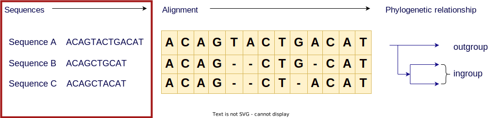
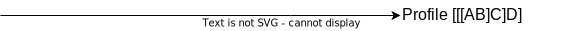

## BIOL8706: Dividing and conquering sequence alignment using De Bruijn Graphs
<!-- paginate: skip -->
<!-- _class: coverpage -->


- Student: Richard Morris
- Huttley lab, Australian National University
- Supervisors: Gavin Huttley, Vijini Mallawaarachchi 

# Project aims
<!-- paginate: true -->
<!-- header: _Dividing and conquering sequence alignment using De Bruijn Graphs_ -->

Explore de Bruijn graphs as a method for improving sequence alignment efficiency, while breaking the tautological conundrum at the heart of bioinformatics
  - Develop a prototype that allows us to 
    - project sets of sequences to a **de Bruijn graph**
    - project a de Bruijn graph to a **partial order graph** 
    - Extract from a partial order graph **fragments** for traditional alignment methods
  - Produce statistics for a partial order graph to estimate compute performance of alignment


# BACKGROUND: Sequence alignment


# BACKGROUND: Sequence alignment
<!-- paginate: hold -->



#### We start with a set of DNA sequences to be aligned

# BACKGROUND: Sequence alignment

<!--Note these sequences are all different lengths -->


#### We align those sequences

# BACKGROUND: Sequence alignment


#### By lining up regions that are similar

# BACKGROUND: Sequence alignment


#### Noting those that are different

# BACKGROUND: Sequence alignment


<!--
In this case I constructed this hypothetical example 
where the only differences are in these deletion events
-->

#### And we can infer evolutionary relationships between those sequences 
- ingroup (1 letter different)
- outgroup (3 letters different)

<!--
In this case I constructed this hypothetical example 
where the only differences are in these deletion events
-->
# BACKGROUND: Sequence alignment
<!-- paginate: hold -->


#### And we can infer evolutionary relationships between those sequences 
- ingroup (1 letter different)
- outgroup (3 letters different)
- likely unobserved ancestor sequence
- how long ago sequences likely diverged

# BACKGROUND: Sequence alignment
<!-- paginate: hold -->


##### Sequence alignment coupled with a phylogeny is a **time machine** for homologous proteins

# 3 applications for sequence alignment
<!-- paginate: true -->

- Evolution of RuBisCO
- Trajectory of the SARS-CoV-2 virus
- Our own Family tree

<!--
These examples are not just random useful things to know 
but they highlight the computational problem 
that motivates the need to find a better way to do sequence alignment
-->

# CASE: Evolution of RuBisCO


- Enzyme that converts CO₂ to organic carbon during photosynthesis
- Sequence alignment can infer it's evolutionary history
- Which we can compare with a geological understanding of the atmosphere at that time
<br>

We can associate **features** appearing in the protein with the **environment** in which it evolved?

<!-- _footer: "[Whitney et al 2012 doi.org/10.1104/pp.110.164814](https://doi.org/10.1104/pp.110.164814) "-->

<!-- This will tell us important things like RuBisCO innovations in response to different partial pressures of O₂ and CO₂-->

# CASE: Trajectory of the spike protein of SARS-CoV-2

<div class="two_columns">
  <div>

Sequence alignment 
- allows us to identify conserved regions to inform vaccine/drug development
- can help us predict the virus's trajectory
  - where it came from
  - where it is going to

  </div>
  <div>
    
    <span>Alignment of S mutation points of SARS-CoV-2 variants</span>
  </div>

# CASE: Our immediate family tree
<div class="two_columns">
  <div>

- How do we differ from other great apes 
- How are we the same
- This has direct applications in biomedical science

  </div>
  <div>
    <figure>
      
      <figcaption>The family tree of great apes</figcaption>
    </figure>
  </div>
</div>

<!-- 
This ability to decompose history can be applied to proteins like RuBisCO, it can be applied to viruses, it can be applied to our own evolution.  Alignment is integral to all of these
-->
# PROBLEM: Sequence alignment is a big job

- Historically sequence alignment was done manually, like a really big evil jigsaw puzzle
- Since 1970$_1$ it has become a computational problem
- The task is to compare **each** letter in **each** sequence with **all** the letters of **every** other sequence.

<br> 

- The terms: **each**, **all** and **every** should tell you that it will be a big job for computers too.

<!-- _footer: "[Needleman & Wunsch, 1970  doi.org/10.1016/0022-2836(70)90057-4](https://doi.org/10.1016/0022-2836(70)90057-4)" -->

# PROBLEM: Exhaustive sequence alignment takes time

A computational scientist might say that the asymptotic complexity of an exhaustive alignment is given by the following big-O notation

## $O(L_1 \times L_2 \times \dots L_\#)$ or $O(L^\#)$

Where: 
- $L$ is the average length of the sequence
- $\#$ is the number of sequences

<div><div class="quote">

<p>“Big-O tells you how code <strong>slows</strong> as data <strong>grows</strong>”</p>
<cite>Ned Batchelder</cite>
</div></div>

<!-- _footer: "[nedbatchelder.com](https://nedbatchelder.com/blog/201310/big_o_log_n.html)"-->

# REFRAME: Work **increases** as data **grows**

Let's rephrase this big-O notation as the order of $Work(L^\#)$

<hr/>

| **Average length (L)** | Number of sequences (#) | $Work$ required (comparisons)|
|---|---|---|
| 1,000 | 3 | 1,000,000,000 |
| 2,000 | 3 | 8,000,000,000 |
| 3,000 | 3 | 27,000,000,000 |
| 4,000 | 3 | 64,000,000,000 |
| 5,000 | 3 | 125,000,000,000 |
| 6,000 | 3 | 216,000,000,000 |
| 7,000 | 3 | 343,000,000,000 |
| 8,000 | 3 | 512,000,000,000 |
| 9,000 | 3 | 729,000,000,000 |
|10,000 | 3 | 1,000,000,000,000 |

# REFRAME: Work **increases** as data **grows**
<!-- _paginate: hold -->

Let's rephrase this big-O notation as the order of $Work(L^\#)$

<hr/>

| Average length (L)| **Number of sequences (#)** | $Work$ required (comparisons)|
|---|---|---|
| 1,000 | 2 | 1,000,000 |
| 1,000 | 3 | 1,000,000,000 |
| 1,000 | 4 | 1,000,000,000,000 |
| 1,000 | 5 | 1,000,000,000,000,000 |
| 1,000 | 6 | 1,000,000,000,000,000,000 |
| 1,000 | 7 | 1,000,000,000,000,000,000,000 |
| 1,000 | 8 | 1,000,000,000,000,000,000,000,000 |
| 1,000 | 9 | 1,000,000,000,000,000,000,000,000,000 |
| 1,000 | 10 | 1,000,000,000,000,000,000,000,000,000,000 |

<!-- I want you to notice this is just 10 sequences -->


# PROBLEM: The scale of our 3 cases

| Case | Average length (L) | Number of sequences (#) | $Work$ required ($L^\#$)|
|---|---|---|---|
| RuBisCO  | 2 kbp| ~350,000 | $\text{2,000}^{350,000}$|
| SARS-CoV-2 | 29 kbp | >5,000,000$_1$ | $\text{29,000}^{5,000,000}$|
| Great apes | 3 gbp | 5 | $\text{3 billion}^5$ |

</br>


## Large computation problems take

- ### Time 
- ### Money
- ### Energy 

<!-- _footer: <sub>1</sub> GISAID had 5.1M copies of SARS-CoV-2 sequences as of Oct 2021 [www.nature.com/articles/s41588-022-01033-y](https://www.nature.com/articles/s41588-022-01033-y) -->

<!-- 
Note: The genes that produce the 2 subunits of RuBisCO are ~1500 and ~500 bp respectively
but the genomes of species that can make RuBisCO can be 1.5 mbp - 150 gbp long
-->
# 
<!-- _paginate: hold -->


<!-- _footer: "Created with the Imgflip Meme Generator"-->
# Progressive alignment

<div class="two_columns">
  <div>

Progressive alignment is a method that reduces the work required

**Strategy**:
- start with a phylogeny

  </div>
  <div>

## Phylogenetic tree


  </div>
</div>


# Progressive alignment
<!-- _paginate: hold -->

<div class="two_columns">
  <div>
  
Progressive alignment is a method that reduces the work required

**Strategy**:
- start with a phylogeny
- align the **most closely related** sequences into a statistical model called a profile

  </div>
  <div>

## Phylogenetic tree


  </div>
</div>


# Progressive alignment
<!-- _paginate: hold -->

<div class="two_columns">
  <div>
  
Progressive alignment is a method that reduces the work required

**Strategy**:
- start with a phylogeny
- align the most closely related sequences into a statistical model called a profile
- align that profile with the **next** most closely related sequence 

  </div>
  <div>

## Phylogenetic tree


  </div>
</div>


# Progressive alignment
<!-- _paginate: hold -->

<div class="two_columns">
  <div>
  
Progressive alignment is a method that reduces the work required

**Strategy**:
- start with a phylogeny
- align the most closely related sequences into a statistical model called a profile
- align that profile with the next most closely related sequence 
- Do that until you have finished aligning **all the sequences**

  </div>
  <div>

## Phylogenetic tree


  </div>
</div>

# Progressive alignment

<div class="two_columns">
  <div>
  
Progressive alignment is a method that reduces the work required

**Strategy**:
- start with a phylogeny
- align the most closely related sequences into a statistical model called a profile
- align that profile with the next most closely related sequence 
- Do that until you have finished aligning all the sequences
<br/>

  </div>
  <div>

## Phylogenetic tree

<br/>
This reduces the order of $Work(L^\#)$ $\rightarrow$ $Work(i.L^2)$ 
- Where $i$ is the number of internal nodes originally in the tree 
  - binary tree: $i=(\#-1)$
  - non-binary tree: $1 \ge i \le (\#-1)$ 

<br/>

## ... That is a lot less $Work$ 

  </div>
</div>


<!-- 
Progressive alignment with a guide tree is used because it gives better results because insertion deletion events occur on the tree.  
So the statistical performance of this approach is better than alternative methods. 
-->

# Progressive multiple sequence alignment (MSA) ...

# 


<!-- _footer: "Created with the Imgflip Meme Generator"-->

# The problem space

Sequence alignment is sensitive to 
- The **length** of sequences to be aligned
- The **number** of sequences to be aligned
- the “ Chicken and Egg ” problem

</hr>

An ideal strategy would reduce 
- The **length** of sequences to be aligned
- The **number** of sequences to be aligned
- Dependence on knowing the phylogeny in advance

<!-- 
Can we reproduce the same statistical behaviour while doing less work 
-->

# What if we could **quickly** remove similar regions?


<br/>
<br/>
<br/>

### We'd could focus on just the regions that differ

# Sequence alignment using De Bruijn Graphs

My work builds upon the work by **Xingjian Leng**$_1$ , under the supervision of **Dr. Yu Lin** and **Prof. Gavin Huttley**. 

Xingjian tackled the length problem using de Bruijn graphs 


de Bruijn graphs can be used for sequence assembly from reads  

De Bruijn graphs can also be used for sequence alignment

<!-- _footer: "$^1$Leng, Xingjian. ‘Sequence Alignment Using De Bruijn Graphs’. Australian National University, 2022 "-->

# De Bruijn graphs


## Building a De Bruijn graph is $Work(nL)$ 

#### This “Work” scales linearly not exponentially.

Consider the following sequence as a de Bruijn graph of order 3 (nodes overlap by 2 characters):


# De Bruijn graphs
<!-- _paginate: hold -->

## Building a De Bruijn graph is $Work(nL)$ 

#### This “Work” scales linearly not exponentially.

Consider the following sequence as a de Bruijn graph of order 3 (nodes overlap by 2 characters):


# De Bruijn graphs
<!-- _paginate: hold -->

## Building a De Bruijn graph is $Work(nL)$ 

#### This “Work” scales linearly not exponentially.

Consider the following sequence as a de Bruijn graph of order 3 (nodes overlap by 2 characters):


# De Bruijn graphs
<!-- _paginate: hold -->

## Building a De Bruijn graph is $Work(nL)$ 

#### This “Work” scales linearly not exponentially.

Consider the following sequence as a de Bruijn graph of order 3 (nodes overlap by 2 characters):


# Reducing the **length** of sequence to be aligned

|||||||||||||||
|--|---|---|---|---|---|---|---|---|---|---|---|---|---|
|Seqence A | C | A | C | A | G | T | A | C | **G** | G | C | A | T |
|Seqence B | C | A | C | A | G | T | A | C | **T** | G | C | A | T |

Produces the following de Bruijn graphs


If we combine both sequences into a single de Bruijn graph, it will develop **“bubbles”** where regions are different.

# Reducing the **length** of sequence to be aligned
<!-- _paginate: hold -->

|||||||||||||||
|--|---|---|---|---|---|---|---|---|---|---|---|---|---|
|Seqence A | C | A | C | A | G | T | A | C | **G** | G | C | A | T |
|Seqence B | C | A | C | A | G | T | A | C | **T** | G | C | A | T |

Produces the following de Bruijn graphs


If we combine both sequences into a single de Bruijn graph, it will develop **“bubbles”** where regions are different.


# Reducing the **length** of sequence to be aligned
<!-- _paginate: hold -->


can be transformed to the partial order graph


We have reduced $Work(14\times 14)=196$ 
to $Work(1 \times 1)=1$ 

## **196x** less “work”.

# De Bruijn **multiple** sequence alignment

Consider aligning 4 sequences

  

We have reduced $Work(13\times 13+13\times 16+16\times 16)=633$ for a progressive alignment
to $Work(1\times 1+1\times 4+4\times 5) = 24$ 

## **26x** less “work” than a progressive alignment

<!-- 
Interesting how the more sequences you add, the greater the potential advantage of using a de Bruijn graph
-->

# Taking the de Bruijn graph to the next level

<br/>
<br/>

## We have changed the length of sequences to align
<br/>
<br/>

## Can we change the **number** of sequences to align?

# RESULT: Reducing the **number** of sequences to be aligned

Consider this partial order graph containing 4 sequences


# RESULT: Reducing the **number** of sequences to be aligned
<!-- _paginate: hold -->

Consider this partial order graph containing 4 sequences


Sequences in bubbles can **braid** together

# RESULT: Reducing the **number** of sequences to be aligned
<!-- _paginate: hold -->


| exhaustive alignment | progressive alignment | reduce length | reduce number |
|---|---|---|---|
|$18 \times 18 \times 18 \times 14$| $(14\times 18)+2(18\times 18)$ | $3(5^2) + 3(3^2)$ | $5^2 + 2(3^2)$ |
| 81,648 | 900 (**>90x** less work) | 102 (**>8x** less work) | 43 (**>2x** less work)|

# RESULT: Reduce the dependence on the phylogeny


By ordering progressive alignment by descending “bubble” depth, we can progressively align without needing to know in advance the phylogenetic relation between sequences.

# RESULT: Reduce the dependence on the phylogeny
<!-- _paginate: hold -->


# RESULT: Reduce the dependence on the phylogeny
<!-- _paginate: hold -->


# RESULT: Reduce the dependence on the phylogeny
<!-- _paginate: hold -->


# RESULT: Reduce the dependence on the phylogeny
<!-- _paginate: hold -->


# RESULT: Reduce the dependence on the phylogeny
<!-- _paginate: hold -->


## Alignment completed without requiring a phylogeny


# RESULT: Work statistic from partial order graphs

Consider the same partial order graph 


- Work calculates the order of alignment work using 4 strategies
  - Exact = $13\times12\times9 = 1404$
  - Progressive = $12\times13+13\times9 = 273$
  - DBG_L = $4\times5+5\times1 = 25$ (simplification of sequence length)
  - DBG_LN =  $0\times1+5\times1 =5$ (simplification of sequence length and count)

# RESULT: Calculated order of Work - TBD

## Sample Sequence sets

| Genomes | Avg. length (bp) | # Sequences | Exact | Progressive | dBG(3)_L | dBG(3)_LN |
|---|---|---|---|---|---|---|
| BRCA1_divergent | ~3k | 7 |  |  |  |
| BRCA1_hominae | ~3k | 4 |  |  |  |
| SARS-CoV-2 | 30k | 22 |  |  |  |
| IBD_phage | 40k | 60 |  |  |  |
| Ocean_phage | 40k | 130 |  |  |  |

# Summary

de Bruijn graphs may offer a method to 
- Reduce the impact of both sequence length and sequence number over traditional alignment approaches 
- Break the tautology at the heart of both Sequence alignment, and Phylogenetic reconstruction

### This method may make some very big questions tractable

# Future directions

- from first principals, in sequences evolved in an order consistent with data from a progressive tree, **to show that the bubbles in the graph correspond to nodes in a tree** and are similarly ordered
- using data with known topologies and unambiguous evolution
  - show that the algorithm has **statistical performance** consistent with progressive alignment
  - show that the algorithm has **superior performance wrt time and memory** to progressive alignment
- investigate sequences in species subject to **lateral gene flow** which progressive alignment struggles with

# Thanks

<div class="two_columns">
  <div>

- Gavin Huttley
- Yu Lin
- Vijini Mallawaarachchi
- Xinjian Leng
</div>
<div>

## ... and the Huttleylab


</div>

# Thanks
<!-- paginate: skip-->

<div class="two_columns">
  <div>

- Gavin Huttley
- Vijini Mallawaarachchi
- Yu Lin
- Xinjian Leng

<br/>
<br/>
<br/>
<br/>

## Q&A


</div>
<div>


## ... and the Huttleylab


</div>

# Citations

- Leng, Xingjian. ‘Sequence Alignment Using De Bruijn Graphs’. Australian National University, 2023.

Whitney, Houtz, and Alonso, ‘Advancing Our Understanding and Capacity to Engineer Nature’s CO2-Sequestering Enzyme, Rubisco’. https://pubmed.ncbi.nlm.nih.gov/20974895/


# Sample data sources

- BRCA1_divergent: BRCA1 gene divergent sample of 7 chosen from among 56 mammal species
- BRCA1_hominae:  BRCA1 gene from 4 hominae 
- SARS-CoV-2: 22 SARS-CoV-2 genomes
- IBD_phage: IBD phage components (https://doi.org/10.1016/j.cell.2015.01.002) |
- Ocean_phage: Tara oceans phage components (https://doi.org/10.1126/science.

# Supplementary
<!-- paginate: skip -->

<div class="two_columns">
<div>
<blockquote>
<p>Abandon all hope ye who pass this point</p>

<cite>Tolkein ... probably</cite>
</blockquote>
</div>
<div>

- [Sequence alignment order complexity](#sequence-alignment-order-complexity)
- [Pairwise sequence alignment methods](#pairwise-sequence-alignment-methods)
- [Multiple sequence alignment strategies](#multiple-sequence-alignment-mas-strategies)
- [unit tests](#unit-tests)


</div>

# Sequence alignment order complexity
<!-- paginate: skip -->
[<<Back to Supplementary](#supplementary)
## Pairwise sequence alignment
- Compare every letter in one sequence to every letter in the other
- order complexity of $O(mn)$ 
  - where **m** and **n** are lengths of the sequences
## Multiple sequence alignment (MSA)
- Perform a pairwise alignment of every sequence to every other sequence
- order complexity of $O(L^n)$ 
  - where **L** is the length of the sequences 
  - **n** is the number of sequences

<!-- The pairwise algorithms are both actually O(mn) where m and n are the lengths of the 2 sequences. -->

# Pairwise sequence alignment methods: $O(mn)$
<!-- paginate: skip -->
[<<Back to Suplementary](#supplementary)
<div class="two_columns">
  <div>

- Needlemann-Wunsch algorithm: global alignment for highly similar sequences
    - scoring system that penalises gaps and mismatches
- Smith-Waterman algorithm: better for local alignment to find conserved domains
    - allows for alignment to reset when the score falls to 0

  </div>
  <div>
Compare each nucleotide in one sequence to each nucleotide in the other sequence

Given a simple scoring system +1 match, -1 mismatch, -2 gap ($\delta$)

Where $F(i,j) = \max \text{of the following}$

$$
\begin{array}{l} 
⇖ F(i-1, j-1) + s(A_i, B_j), \quad \text{(match/mismatch)}\\
⇑ F(i-1, j) + \delta, \quad \text{(deletion)}\\
⇐F(i, j-1) + \delta, \quad \text{(insertion)}
\end{array}
$$

|  | gap  | A | G | C | A |  A |
|----|---|---|---|---|---|---|
|**gap**|**_0_**|⇐-2|⇐-4|⇐-6|⇐-8|⇐-10
| **A** |⇑-2| ⇖ **_1_** |⇐ **-1** |⇐-3 |⇐-5 |⇐⇖-7|
| **C** |⇑-4|⇑-1 |⇖0 |⇖ **_0_** |⇐-2 |⇐-4|
| **G** |⇑-6|⇑-3 |⇖0 |⇖-1 |⇖ **_1_** |⇐-1|
| **A** |⇑-8|⇖⇑-5 |⇑-2 |⇖-1 | ⇑-1|⇖ **_2_**|
| **A** |⇑-10|⇖⇑-7 |⇑-4 |⇖⇑-3 |⇖-2|⇖⇑ **_0_**|

backtrace from bottom right selecting the value that _**maximizes**_ the alignment score results in the following alignment 

|||||||
|---|---|---|---|---|---|
| sequence 1 | - | C | G | A | A |
| sequence 2 | G | C | G | A | - |

  </div>
</div>

# Multiple sequence alignment (MAS) strategies  
<!-- paginate: skip -->
[<<Back to Supplementary](#supplementary)

- Pairwise alignment of each possible pair
    - ${n\choose 2} \times O(L^2) = \frac{n(n-1)}{2} \times O(L^2) = O(n^2.L^2)$
- Progressive alignment eg: ClustalW
    - create a guide tree  
    - Progressively align pairs most closely related to profiles, and then align profiles 
- Iterative methods  eg: MUSCLE, T-Coffee, MAAFT
    - create an preliminary fast less accurate alignment 
    - iteratively improve alignment using some scoring function
    - Complete when some convergence criterion is met
- Hidden markov models $O(nL) + O(LM)$ (M is the number of states in the model)
    - eg: HMMER
    - create a statical model of the transition between states 
    - Determine likely alignment based on the model

# Unit tests
<!-- paginate: skip -->
[<<Back to Errata](#errata)

library against edge case sequence alignments
      * long sequences
      * numerous sequences
      * [cyclic sequences](#cyclic-sequences)
      * bubbles within bubbles
      * sequential bubbles

# cyclic sequences

```python
def test_pog_cycle(output_dir: Path):
    dbg = dbg_align.DeBrujinGraph(3,cogent3.DNA)
    dbg.add_sequence({
        "seq1": "ACAGTACGGCAT", 
        "seq2": "ACAGTACTGGCAT", 
        "seq3":"ACAGCGCGCAT" # contains cycle
        })
    with open(output_dir / "cycle.md", "w") as f:
        f.write("```mermaid\n")
        f.write(dbg.to_mermaid())
        f.write("```")   
    assert dbg.has_cycles()
    assert len(dbg) == 3
    assert dbg.names() == ["seq1", "seq2", "seq3"]
    assert dbg["seq3"] == "ACAGCGCGCAT" # contains cycle
     
    dbg.to_pog()
    # write mermaid out to testout folder
    with open(output_dir / "cycle_compressed.md", "w") as f:
        f.write("```mermaid\n")
        f.write(dbg.to_mermaid())
        f.write("```")
```
