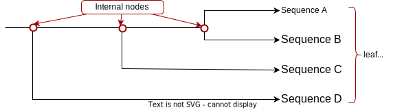
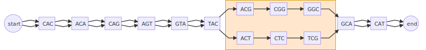

## BIOL8706: Dividing and conquering sequence alignment using De Bruijn Graphs
<!-- paginate: skip -->
<!-- _class: coverpage -->


- Student: Richard Morris
- Huttley lab, Australian National University
- Supervisors: Gavin Huttley, Vijini Mallawaarachchi 

# Sequence alignment
<!-- paginate: true -->
<!-- header: _Dividing and conquering sequence alignment using De Bruijn Graphs_ -->


**What?**: _arranges sequences of DNA, RNA or Protein to identify regions of similarity_
**Why?**: _Uncover evolutionary relationships between sequences_
**How?**: _comparing each letter in each sequence with every other letter_

<!-- 
Imagine being able to unravel the path of evolution of any protein 
to design better crops for yield
This is a case for sequence alignment
-->

# Consider Rubisco


- one of the most abundant proteins on Earth 

<!-- _footer: "[Parry et al 2012 doi.org/10.1093/jxb/ers336](https://doi.org/10.1093/jxb/ers336) "-->

# Consider Rubisco
<!-- _paginate: hold -->


- one of the most abundant proteins on Earth 
- **essential component of photosynthesis**
<!-- _footer: "[Parry et al 2012 doi.org/10.1093/jxb/ers336](https://doi.org/10.1093/jxb/ers336) "-->

# Consider Rubisco
<!-- _paginate: hold -->


- one of the most abundant proteins on Earth 
- essential component of photosynthesis
- **primary role is to convert CO₂ to organic carbon**

<!-- _footer: "[Parry et al 2012 doi.org/10.1093/jxb/ers336](https://doi.org/10.1093/jxb/ers336) "-->

# Evolution of Rubisco


- Genomic sequencing has identified 3 different clades of Rubisco, in 3 kingdoms of life
- Phylogenetic analysis suggests when **innovations** in Rubisco appeared 
- We can compare that to the Earths atmosphere at that time

<!-- _footer: "[Whitney et al 2012 doi.org/10.1104/pp.110.164814](https://doi.org/10.1104/pp.110.164814) "-->

<!-- This will tell us important things like Rubisco innovations for different partial pressures of O₂ and CO₂-->
# The value of understanding Rubisco innovations?

- Rubisco is very slow 
- Q: Can we design more efficient Rubisco?
- $\uparrow$ Rubisco efficiency would lead to
  - Food crop yield $\uparrow$
  - Carbon sequestration $\uparrow$
  - Biological hydrocarbon (eg: CH₄) production $\uparrow$

<!-- 
Rubisco processes ~3-10 CO₂ molecules per second
Contrast with ATP Synthase which generates 100-200 molecules of ATP per second
Can we engineer organisms that spend less time making Rubisco, and more into extracting CO₂ from the atmosphere and making **carbohydrates** or **hydrocarbons**

-->

# Consider the spike protein of SARS-CoV-2

<div class="two_columns">
  <div>

#### Alignment of eg: a viral genome allows us to:
  * Identify conserved regions for vaccine/drug development
  * Identify changes in function to make predictions about the virus' behaviour
  * Identify and prepare for emerging variants

  </div>
  <div>
    
    <span>Alignment of S mutation points of SARS-CoV-2 variants</span>
  </div>

# Consider our immediate family
<div class="two_columns">
  <div>

- How do we differ from our closest relatives?
- What was happening when our species diverged one from another?
- What can we learn about our own evolution from our closest relatives?
- How can that knowledge inform biomedical science

  </div>
  <div>
    <figure>
      
      <figcaption>The family tree of great apes</figcaption>
    </figure>
  </div>
</div>

# How we build a phylogeny from extant sequences


<br/>

- Sequence alignment is the first step in building a phylogeny
- Exhaustive alignment compares every character in each sequence with every character in every other sequence

# Exhaustive alignment takes time

A computational scientist might say that the asymptotic complexity of an exhaustive alignment is given by 

## $O(L^n)$ 

Where: 
- $L$ is the average length of the sequence
- $n$ is the number of sequences

<div><div class="quote">
<p>“ Big-O tells you how code slows as data grows ”</p>
<cite>Ned Batchelder</cite>
</div></div>

<!-- _footer: "[nedbatchelder.com](https://nedbatchelder.com/blog/201310/big_o_log_n.html)"-->

# 

Let's rephrase this big-O notation into a more biologically relevant concept of **“Work”**

<hr/>

So we can say that **“Work”** slows as data grows

| Sequence length | **number of sequences** | “Work” required (comparisons)|
|---|---|---|
| 1,000 | 2 | 1,000,000 |
| 1,000 | 3 | 1,000,000,000 |
| 1,000 | 4 | 1,000,000,000,000 |
| 1,000 | 5 | 1,000,000,000,000,000 |

# 
<!-- _paginate: hold -->

Let's rephrase this big-O notation into a more biologically relevant concept of **“Work”**

<hr/>

So we can say that **“Work”** slows as data grows

| **Sequence length** | number of sequences | “Work” required (comparisons)|
|---|---|---|
| 1,000 | 3 | 1,000,000,000 |
| 2,000 | 3 | 8,000,000,000 |
| 3,000 | 3 | 27,000,000,000 |
| 4,000 | 3 | 64,000,000,000 |

# The scale of our big questions

| Genomes | Length (bp) | Number | “Work” required |
|---|---|---|---|
| Rubisco producers | 1.5-500 mbp|>350,000$_1$| $\text{millions}^\text{hundreds\ of\ thosands}$|
| SARS-CoV-2 | ~29,903 | >5 million$_2$ | $29,903^\text{5 million}$|
| Great apes | ~30mbp | 5 | $\text{30 million}^5$ |

</br>

$^1$ ~ 300k species of plants + 10's of thousands of species of algae + thousands of species of cyanobacteria
$^2$ 5.1 million as of Oct 2021 - [www.nature.com/articles/s41588-022-01033-y](https://www.nature.com/articles/s41588-022-01033-y)
<!-- 
Note: The genes that produce the 2 subunits of Rubisco are ~1500 and ~500 bp respectively
but the genomes of species that can make Rubisco can be 1.5 - 500 mbp long 
we need to align the entire sequence to find where Rubisco is being passed down the lineage
-->

# 


<!-- _footer: "Created with the Imgflip Meme Generator"-->
# Progressive alignment

We can reduce the work required as follows
- align the 2 most closely related sequences $O(L^2)$ into a statistical model called a profile
- align that profile with the next most closely related sequence ${n\choose{2}}$ times
<br/>

This reduces the work required from $O(L^n)$ $\rightarrow$ $O(n^2.L^2)$ 



# Do you see the problem?

- To align multiple sequences first reconstruct a phylogenetic tree to select the 2 most closely related
- To reconstruct a phylogeny first align all sequences 

# 


<!-- _footer: "Created with the Imgflip Meme Generator"-->

# The problem space

Recall: Sequence alignment is sensitive to 
- The **length** of sequences to be aligned
- The **number** of sequences to be aligned
- the “ Chicken and Egg ” problem

</hr>

An ideal strategy would reduce 
- The **length** of sequences to be aligned
- The **number** of sequences to be aligned
- Reliance on knowing the phylogenetic relationships of the sequences in advance

# What if we could **quickly** remove similar regions?


### We'd could focus our computational resources on just the regions that differ

# Sequence alignment using De Bruijn Graphs

This work builds on the work by Xingjian Leng in a 12 month undergraduate research project in 2022, under the supervision of Dr. Yu Lin and Prof. Gavin Huttley. 

Xingjian Leng tackled the length problem using de Bruijn graphs 

# De Bruijn graphs

A De Bruijn graph is a directed graph that represents unique overlapping subsequences (or k-mers) at the nodes.  This structure is an efficient way to identify sequence overlaps, and common regions.  

Building a De Bruijn graph has an order complexity of $O(nL)$ in other words “Work” scales linearly not exponentially.


# Reducing the length of sequence to be aligned

Consider the DNA sequence $\boxed{CACAGTACGGCAT}$ 

When we represent that as a de Bruijn graph it looks like this:


# Reducing the length of sequence to be aligned
<!-- _paginate: hold -->
Consider we want to align that sequence $\boxed{CACAGTAC\boxed{G}GCAT}$ to the very similar sequence $\boxed{CACAGTAC\boxed{T}CGCAT}$

Which as a De Bruijn graph looks like this:


# Reducing the length of sequence to be aligned
<!-- _paginate: hold -->

Sequence A: 

Sequence B: 

If we combine both sequences into a single de Bruijn graph, it will develop “bubbles” where regions are different.




# Reducing the length of sequence to be aligned
<!-- _paginate: hold -->

We can collect nodes with 2 edge, or 1 edge into single nodes, and we can see the regions that are similar and the regions that are different (in the gold box).


Now we can use a traditional algorithm to align the regions $\boxed{AC\boxed{G}GC}$ and $\boxed{AC\boxed{T}GC}$, and we've reduced our “Work” function from $O(14^2)$ down to $O(5^2)$ = **7.8x** less work.

<!-- 
An attentive observer may notice that because a de Bruijn graph with order 3 has an overlap of 2
the first and last 2 letters don't need to be aligned either so the work function in this case can be reduced to $O(1^2)$
-->

# De Bruijn multiple sequence alignment

And we can extend this to multiple sequences.  Consider aligning the following sequences
`CACAGTACGGCAT` `CACAGTACTGCAT` `CACAGTACTGGAGCAT`& `CACAGTACTGATGCAT`

</br>

<div class="two_columns">
  <div>

  

  </div>
  <div>
    Now we've reduced O(13x13x16x16) down to O(6x6x8x8) = <strong>18.8x</strong> less work
  </div>
</div>

# Reducing the number of sequences to be aligned

- recall an exact alignment has an order complexity of $O(L^n)$
- if we reduce the length of the sequences we need to align we reduce L

# Reducing the number of sequences to be aligned
<!-- _paginate: hold -->

- recall an exact alignment has an order complexity of $O(L^n)$
- if we reduce the length of the sequences we need to align we reduce L
#### **How about n?**

# Reducing the number of sequences to be aligned

Consider this de Bruijn graph containing 4 sequences


# Reducing the number of sequences to be aligned
<!-- _paginate: hold -->

Consider this de Bruijn graph containing 4 sequences


We don't have to align 4 sub-sequences at each alignment if sub-sequences that are the same braid together.

# Reducing the reliance on the phylogeny


“Bubbles” that have shorter edges will be more closely related than “bubbles” with longer edges.

By ordering progressive alignment by ascending “bubbles” size, we can progressively align without needing to know in advance the phylogenetic relation between sequences.

# Project aims

* Investigate De Bruijn graphs for multi-sequence alignment (MSA)
* Build a python library 
    * Resolve the De Bruijn graph to a partial order graph
    * identify “bubbles”
    * Develop unit tests to verify correctness of the algorithm
* Develop statistics for de Bruijn graphs to predict efficiency

# Results: Fastwork statistic

Consider this de Bruijn graph containing 3 sequences [ACAGTACGGCAT, ACAGTACTGGCAT, ACAGCGCAT] of length 12, 13 and 9
When Transformed into a partial order graph 


Contains the following nodes (left to right) with overlap removed AC+T+G+C+AT 

Fastwork = $\sum\text{node length - overlap}$ = $7$
Fastwork is an estimate of alignment required present in the de Bruijn graph that has a “ Work ” function of $O(node\_count)$


# Results: Work statistic

Consider the same de Bruijn graph 


- Work calculates the order complexity of alignment using 4 strategies
  - Exact = $13\times12\times9 = 1404$
  - Progressive = $13\times12+13\times9 = 285$
  - DBG_L = $7\times8+8\times1 = 64$
  - DBG_LN =  $0\times1+5\times1 =5$

  <!-- Why is DBG_LN() different from fastwork() -->

# Results: Calculated from alignable sequences
- BRCA1 genes in 56 species (citation needed)
- BRCA1 genes in primates (citation needed)
- SARS-CoV-2 genomes (citation needed)
- IBD phage components (https://doi.org/10.1016/j.cell.2015.01.002)
- Tara oceans phage components (https://doi.org/10.1126/science.1261605)

# Results: Calculated order complexity from alignable sequences

| kmer | Genomes | Exact | Progressive | dBG_L | dBG_LN |
|---|---|---|---|---|---|
| 3 | BRCA1 56 species |  |  |  |  |
| 3 | BRCA1 primates |  |  |  |  |
| 3 | SARS-CoV-2 |  |  |  |  |
| 3 | IBD phage |  |  |  |  |
| 3 | Tara oceans phage |  |  |  |  |

# Results: Calculated order complexity from alignable sequences
<!-- _paginate: hold -->

| kmer | Genomes | Exact | Progressive | dBG_L | dBG_LN |
|---|---|---|---|---|---|
| 6 | BRCA1 56 species |  |  |  |  |
| 6 | BRCA1 primates |  |  |  |  |
| 6 | SARS-CoV-2 |  |  |  |  |
| 6 | IBD phage |  |  |  |  |
| 6 | Tara oceans phage |  |  |  |  |
# Results: Calculated order complexity from alignable sequences
<!-- _paginate: hold -->

| kmer | Genomes | Exact | Progressive | dBG_L | dBG_LN |
|---|---|---|---|---|---|
| 9 | BRCA1 56 species |  |  |  |  |
| 9 | BRCA1 primates |  |  |  |  |
| 9 | SARS-CoV-2 |  |  |  |  |
| 9 | IBD phage |  |  |  |  |
| 9 | Tara oceans phage |  |  |  |  |

# Results: Calculated fastwork from alignable sequences

| Genomes | dBG(3) | dBG(4) | dBG(5) | dBG(6) | dBG(7) | dBG(8) | dBG(9) | 
|---|---|---|---|---|---|---|---|
| BRCA1 56 species |  
| BRCA1 primates |  
| SARS-CoV-2 |  
| IBD phage |  
| Tara oceans phage |

# Sample unit tests: cyclic sequences
```python
def test_pog_cycle(output_dir: Path):
    dbg = dbg_align.DeBrujinGraph(3,cogent3.DNA)
    dbg.add_sequence({
        "seq1": "ACAGTACGGCAT", 
        "seq2": "ACAGTACTGGCAT", 
        "seq3":"ACAGCGCGCAT" # contains cycle
        })
    with open(output_dir / "cycle.md", "w") as f:
        f.write("```mermaid\n")
        f.write(dbg.to_mermaid())
        f.write("```")   
    assert dbg.has_cycles()
    assert len(dbg) == 3
    assert dbg.names() == ["seq1", "seq2", "seq3"]
    assert dbg["seq1"] == "ACAGTACGGCAT"
    assert dbg["seq2"] == "ACAGTACTGGCAT"
    assert dbg["seq3"] == "ACAGCGCGCAT" # contains cycle
     
    dbg.to_pog()
    # write mermaid out to testout folder
    with open(output_dir / "cycle_compressed.md", "w") as f:
        f.write("```mermaid\n")
        f.write(dbg.to_mermaid())
        f.write("```")
```

# Discussion

de Bruijn graphs offer an interesting method to 
- Break through the tautology at the heart of both Sequence alignment, and Phylogenetic reconstruction
- Reduce the impact of sequence length and sequence number on traditional alignment approaches 

### This method may make some very big questions tractable

# Future directions

Investigate the potential of using de Bruijn Graphs to;

- Identify reverse complimented regions from a dBG
- Identify genetic distance and infer phylogeny from a dBG
- Process sequences in databases storing dBG structures back to the database, reducing active memory limits for large numbers of large sequences
- Investigate advantage wrt species subject to lateral gene flow 
  - eg: Bacteria, Archaea
  - identifying multi-rooted phylogenies 
- Investigate using dBG's for targeted sequence extraction using pattern recognition templates ( start and stop fragments similar to PCR primers)


# Thanks

<div class="two_columns">
  <div>

- Gavin Huttley
- Yu Lin
- Vijini Mallawaarachchi
- Xinjian Leng
</div>
<div>

## ... and the Huttleylab


</div>


# Questions

# Errata

<div>
<blockquote>
<p>Abandon all hope ye who pass this point</p>

<cite>Tolkein ... probably</cite>
</blockquote>
</div>

# Sequence alignment order complexity

## Pairwise sequence alignment
- Compare every letter in one sequence to every letter in the other
- order complexity of $O(mn)$ 
  - where **m** and **n** are lengths of the sequences
## Multiple sequence alignment (MSA)
- Perform a pairwise alignment of every sequence to every other sequence
- order complexity of $O(L^n)$ 
  - where **L** is the length of the sequences 
  - **n** is the number of sequences

<!-- The pairwise algorithms are both actually O(mn) where m and n are the lengths of the 2 sequences. -->

# Pairwise sequence alignment methods: $O(mn)$
<div class="two_columns">
  <div>

- Needlemann-Wunsch algorithm: global alignment for highly similar sequences
    - scoring system that penalises gaps and mismatches
- Smith-Waterman algorithm: better for local alignment to find conserved domains
    - allows for alignment to reset when the score falls to 0

  </div>
  <div>
Compare each nucleotide in one sequence to each nucleotide in the other sequence

Given a simple scoring system +1 match, -1 mismatch, -2 gap ($\delta$)

Where $F(i,j) = \max \text{of the following}$

$$
\begin{array}{l} 
⇖ F(i-1, j-1) + s(A_i, B_j), \quad \text{(match/mismatch)}\\
⇑ F(i-1, j) + \delta, \quad \text{(deletion)}\\
⇐F(i, j-1) + \delta, \quad \text{(insertion)}
\end{array}
$$

|  | gap  | A | G | C | A |  A |
|----|---|---|---|---|---|---|
|**gap**|**_0_**|⇐-2|⇐-4|⇐-6|⇐-8|⇐-10
| **A** |⇑-2| ⇖ **_1_** |⇐ **-1** |⇐-3 |⇐-5 |⇐⇖-7|
| **C** |⇑-4|⇑-1 |⇖0 |⇖ **_0_** |⇐-2 |⇐-4|
| **G** |⇑-6|⇑-3 |⇖0 |⇖-1 |⇖ **_1_** |⇐-1|
| **A** |⇑-8|⇖⇑-5 |⇑-2 |⇖-1 | ⇑-1|⇖ **_2_**|
| **A** |⇑-10|⇖⇑-7 |⇑-4 |⇖⇑-3 |⇖-2|⇖⇑ **_0_**|

backtrace from bottom right selecting the value that _**maximizes**_ the alignment score results in the following alignment 

|||||||
|---|---|---|---|---|---|
| sequence 1 | - | C | G | A | A |
| sequence 2 | G | C | G | A | - |

  </div>
</div>

# Multiple sequence alignment (MAS) strategies  
- Pairwise alignment of each possible pair
    - ${n\choose 2} \times O(L^2) = \frac{n(n-1)}{2} \times O(L^2) = O(n^2.L^2)$
- Progressive alignment eg: ClustalW
    - create a guide tree  
    - Progressively align pairs most closely related to profiles, and then align profiles 
- Iterative methods  eg: MUSCLE, T-Coffee, MAAFT
    - create an preliminary fast less accurate alignment 
    - iteratively improve alignment using some scoring function
    - Complete when some convergence criterion is met
- Hidden markov models $O(nL) + O(LM)$ (M is the number of states in the model)
    - eg: HMMER
    - create a statical model of the transition between states 
    - Determine likely alignment based on the model

# Unit tests
library against edge case sequence alignments
      * long sequences
      * numerous sequences
      * cyclic sequences
      * bubbles within bubbles
      * sequential bubbles